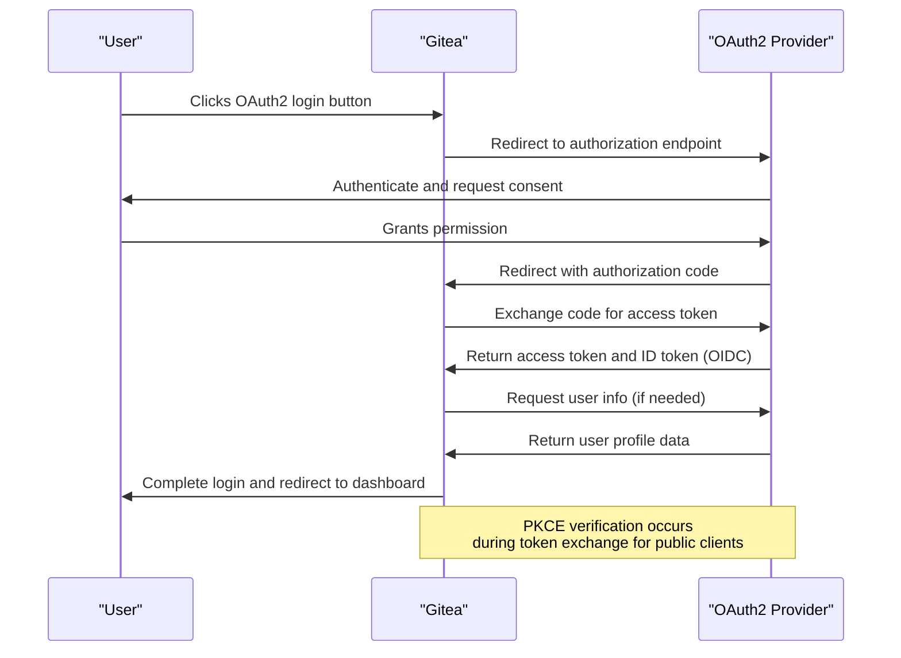
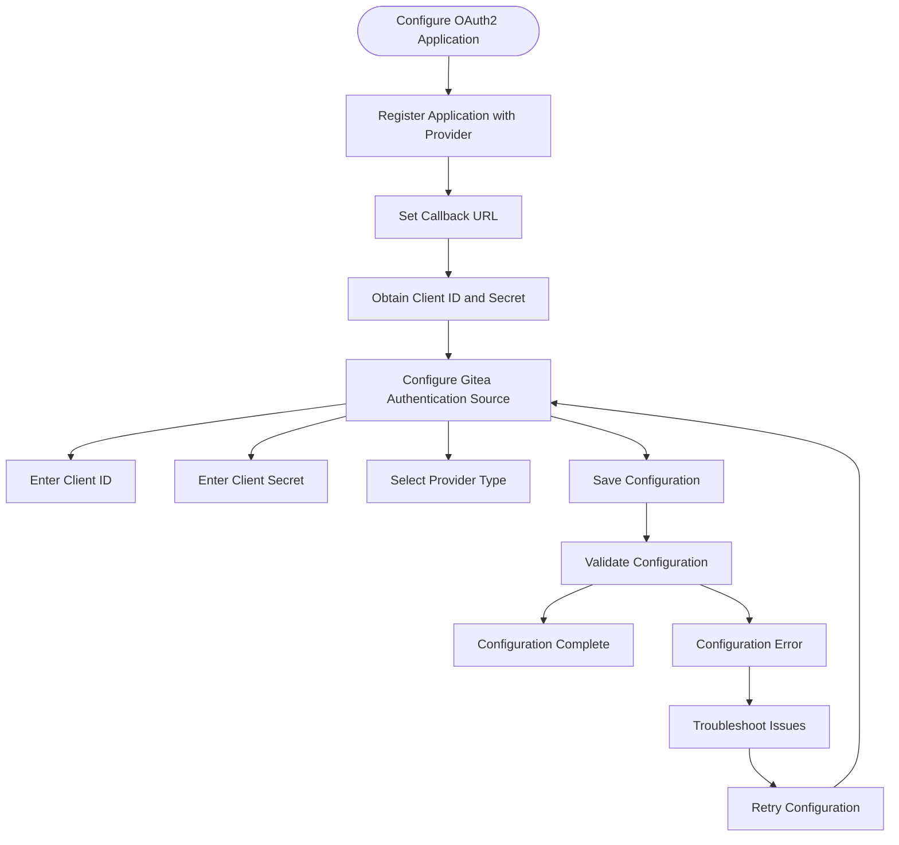
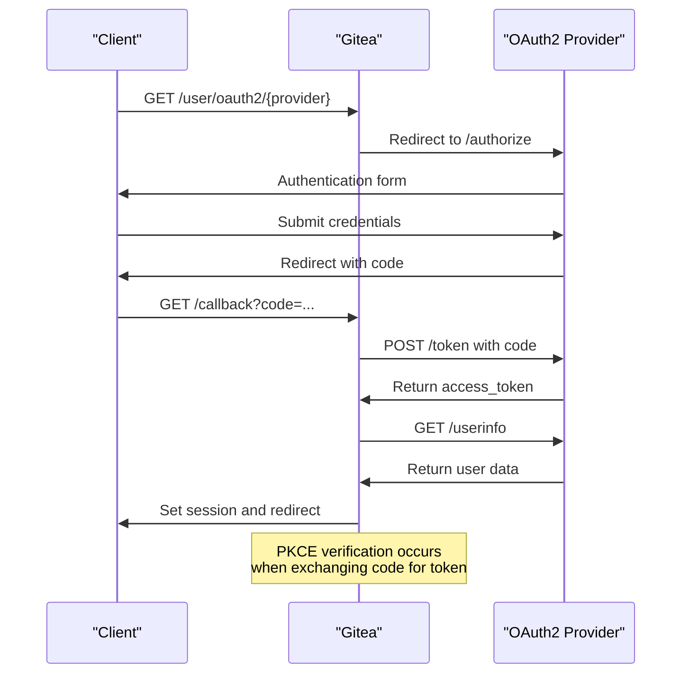
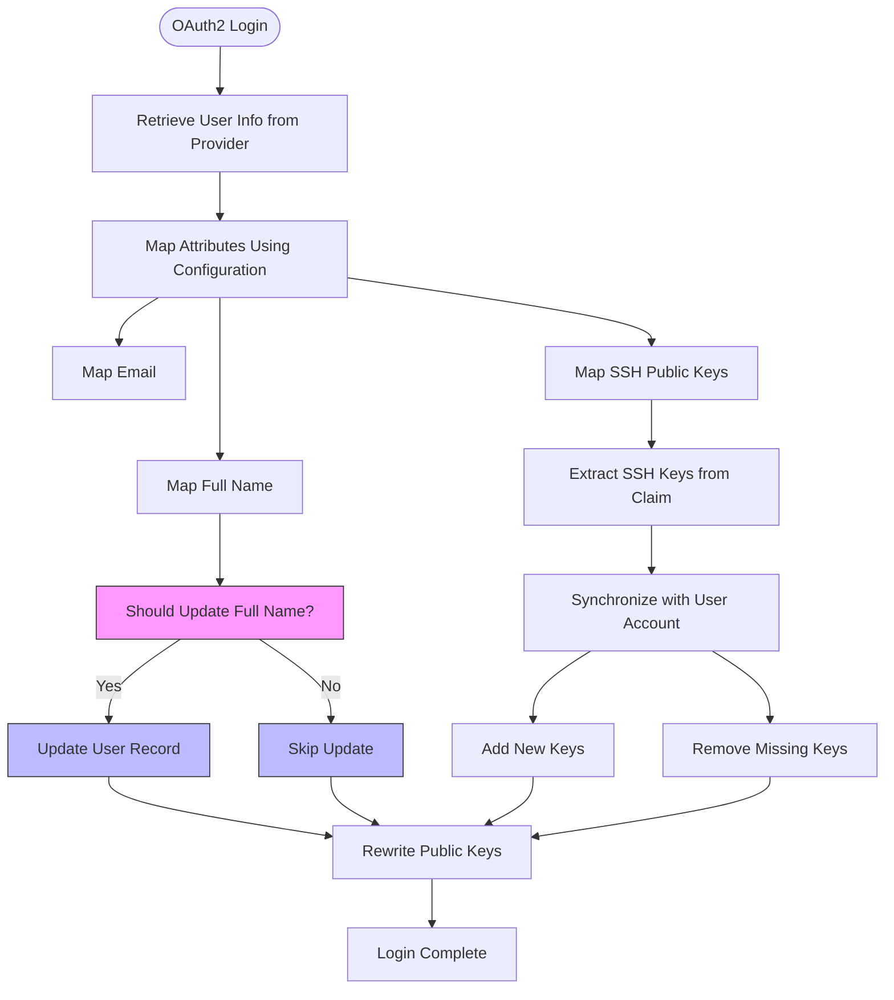
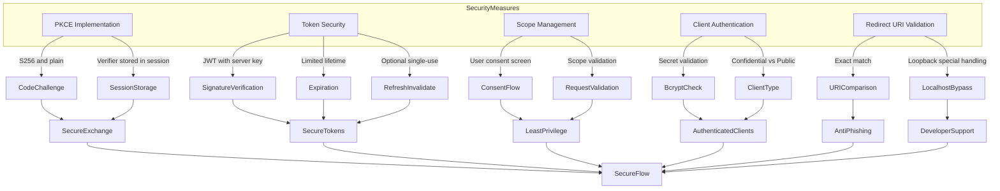
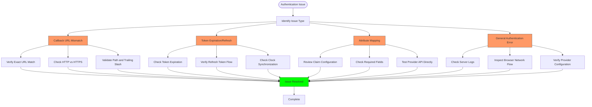

# OAuth2 Authentication

<cite>
**Referenced Files in This Document**   
- [oauth.go](file://routers/web/auth/oauth.go)
- [oauth2.go](file://models/auth/oauth2.go)
- [token.go](file://services/oauth2_provider/token.go)
- [oauth2_provider.go](file://routers/web/auth/oauth2_provider.go)
- [oauth_signin_sync.go](file://routers/web/auth/oauth_signin_sync.go)
</cite>

## Table of Contents
1. [Introduction](#introduction)
2. [OAuth2 Flow Overview](#oauth2-flow-overview)
3. [Configuration of OAuth2 Applications](#configuration-of-oauth2-applications)
4. [Authorization Code Flow Implementation](#authorization-code-flow-implementation)
5. [User Synchronization and Attribute Mapping](#user-synchronization-and-attribute-mapping)
6. [Security Considerations](#security-considerations)
7. [Troubleshooting Common Issues](#troubleshooting-common-issues)
8. [Conclusion](#conclusion)

## Introduction
Gitea supports OAuth2 and OpenID Connect (OIDC) authentication, enabling users to sign in using external identity providers such as GitHub, Google, and others. This document details the OAuth2 authentication mechanism in Gitea, covering the complete flow from user initiation to token exchange and user information retrieval. It explains configuration procedures for both Gitea and external providers, including client ID, secret, and callback URL setup. The implementation of the authorization code flow with PKCE, user synchronization, and security considerations such as token validation and scope management are also addressed. Guidance on troubleshooting common issues like callback mismatches, token expiration, and user attribute mapping is provided.

## OAuth2 Flow Overview
The OAuth2 authentication process in Gitea follows the authorization code flow, which is suitable for both confidential and public clients. When a user initiates login via an OAuth2 provider, Gitea redirects them to the provider's authorization endpoint. Upon successful authentication and consent, the provider redirects back to Gitea's callback URL with an authorization code. Gitea then exchanges this code for an access token and retrieves user information from the provider's userinfo endpoint.

For public clients, Proof Key for Code Exchange (PKCE) is enforced to prevent authorization code interception attacks. The client generates a code verifier and its transformed challenge, which are sent during authorization and token requests. Gitea validates the code verifier against the stored challenge before issuing tokens.

OpenID Connect integration extends OAuth2 by providing identity layer capabilities. Gitea supports OIDC discovery through the `.well-known/openid-configuration` endpoint and JWKs for token signature verification. The ID token issued during OIDC flows contains user identity information signed with a JWT key.

**Diagram sources**
- [oauth.go](file://routers/web/auth/oauth.go#L1-L520)
- [oauth2_provider.go](file://routers/web/auth/oauth2_provider.go#L1-L681)

**Section sources**
- [oauth.go](file://routers/web/auth/oauth.go#L1-L520)
- [oauth2_provider.go](file://routers/web/auth/oauth2_provider.go#L1-L681)

## Configuration of OAuth2 Applications
Configuring OAuth2 applications in Gitea involves setting up both the external provider and Gitea's authentication source. In external providers like GitHub or Google, administrators must register a new OAuth application, specifying the callback URL as `https://<gitea-domain>/user/oauth2/<provider-name>/callback`. The provider returns a client ID and client secret, which are entered in Gitea's administrative interface under Authentication Sources.

In Gitea, OAuth2 authentication sources are configured through the web interface or API. Key configuration parameters include:
- **Client ID**: The identifier issued by the external provider
- **Client Secret**: The confidential credential issued by the external provider
- **Provider**: Selection of supported providers (GitHub, Google, etc.)
- **Custom URLs**: Optional override of default endpoints for self-hosted or non-standard providers
- **Group Claim Mapping**: Configuration for team synchronization based on group claims

The callback URL is automatically generated based on the authentication source name and follows the pattern `/user/oauth2/{authName}/callback`. This URL must exactly match the one registered with the external provider, including protocol and trailing slashes.

**Diagram sources**
- [oauth.go](file://routers/web/auth/oauth.go#L50-L100)
- [oauth2_provider.go](file://routers/web/auth/oauth2_provider.go#L150-L200)

**Section sources**
- [oauth.go](file://routers/web/auth/oauth.go#L50-L100)
- [oauth2_provider.go](file://routers/web/auth/oauth2_provider.go#L150-L200)

## Authorization Code Flow Implementation
The authorization code flow implementation in Gitea is handled through several key components across different packages. The flow begins with the `SignInOAuth` handler in `routers/web/auth/oauth.go`, which redirects users to the external provider's authorization endpoint. After successful authentication, the provider redirects back to Gitea's callback endpoint, where `SignInOAuthCallback` processes the authorization code.

The core logic for handling OAuth2 callbacks is implemented in `oAuth2UserLoginCallback`, which validates the authorization response, exchanges the code for tokens, and retrieves user information. This function integrates with the Goth library to handle provider-specific authentication flows while maintaining a consistent interface.

Token issuance and validation are managed by the `services/oauth2_provider` package. The `AccessTokenOAuth` handler processes token requests, validating client credentials and authorization codes. For authorization code grants, it verifies the PKCE code challenge before issuing access and refresh tokens. Tokens are implemented as JWTs signed with a server-managed key, containing claims such as grant ID, token type, and usage counter.

**Diagram sources**
- [oauth.go](file://routers/web/auth/oauth.go#L100-L300)
- [oauth2_provider.go](file://routers/web/auth/oauth2_provider.go#L400-L600)

**Section sources**
- [oauth.go](file://routers/web/auth/oauth.go#L100-L300)
- [oauth2_provider.go](file://routers/web/auth/oauth2_provider.go#L400-L600)

## User Synchronization and Attribute Mapping
Gitea synchronizes user attributes from external OAuth2 providers during the authentication process. The `oauth2SignInSync` function in `routers/web/auth/oauth_signin_sync.go` handles this synchronization, updating user profile information such as full name and SSH public keys based on claims received from the provider.

User attribute mapping is configurable through the authentication source settings. Administrators can specify which JSON claim from the provider's userinfo response corresponds to Gitea user attributes. For example, the full name can be mapped to the `name`, `displayName`, or a custom claim specified in the configuration. If no custom claim is specified, Gitea falls back to standard OIDC claims.

The synchronization process occurs during each successful OAuth2 login. For the full name attribute, Gitea updates the user record only if the current value is empty or if the "Always update" option is enabled in the authentication source configuration. This prevents overwriting user-edited names unless explicitly configured.

SSH public key synchronization is supported through a configurable claim that contains an array of SSH key strings. When enabled, Gitea synchronizes these keys with the user's account, automatically adding new keys and removing keys that no longer appear in the provider's response.

**Diagram sources**
- [oauth_signin_sync.go](file://routers/web/auth/oauth_signin_sync.go#L1-L94)
- [oauth.go](file://routers/web/auth/oauth.go#L300-L400)

**Section sources**
- [oauth_signin_sync.go](file://routers/web/auth/oauth_signin_sync.go#L1-L94)
- [oauth.go](file://routers/web/auth/oauth.go#L300-L400)

## Security Considerations
Gitea implements several security measures to protect OAuth2 authentication flows. Proof Key for Code Exchange (PKCE) is enforced for public clients to prevent authorization code interception attacks. The implementation supports both `S256` and `plain` code challenge methods, with `S256` being the recommended approach for enhanced security.

Token management follows OAuth2 best practices, with access tokens having limited lifetimes and refresh tokens optionally invalidated after use when `IN_VALIDATE_REFRESH_TOKENS` is enabled. Tokens are implemented as signed JWTs, with signatures verified using server-managed keys. The signing key can be configured through the `JWT_SECRET` setting and supports various cryptographic algorithms.

Scope management ensures that applications only receive the permissions they request and users authorize. Gitea validates requested scopes against registered application scopes and presents users with a consent screen for additional permissions. The scope parameter is validated during both authorization and token requests to prevent privilege escalation.

Client authentication is required for confidential clients, with client secrets validated using secure hashing (bcrypt). Public clients are identified by their redirect URIs, with loopback addresses receiving special handling for desktop applications. Redirect URI validation performs exact matching, preventing open redirect vulnerabilities.

**Diagram sources**
- [oauth2.go](file://models/auth/oauth2.go#L200-L400)
- [token.go](file://services/oauth2_provider/token.go#L1-L95)
- [oauth2_provider.go](file://routers/web/auth/oauth2_provider.go#L200-L400)

**Section sources**
- [oauth2.go](file://models/auth/oauth2.go#L200-L400)
- [token.go](file://services/oauth2_provider/token.go#L1-L95)
- [oauth2_provider.go](file://routers/web/auth/oauth2_provider.go#L200-L400)

## Troubleshooting Common Issues
Common issues in OAuth2 authentication typically involve configuration mismatches, token handling problems, or user attribute mapping errors. The most frequent issue is callback URL mismatch, where the redirect URI registered with the external provider does not exactly match the one configured in Gitea. This results in authorization errors and can be resolved by verifying the exact URL, including protocol, domain, port, and path.

Token expiration issues may occur when access tokens are not properly refreshed. Gitea handles refresh tokens according to the OAuth2 specification, but misconfigurations in the refresh token flow or clock skew between systems can cause authentication failures. Ensuring proper time synchronization and checking refresh token storage can resolve these issues.

User attribute mapping problems often stem from incorrect claim configuration or missing required fields in the provider's response. When auto-registration is enabled, Gitea requires certain fields (sub, email, and username) to be present in the userinfo response. Missing fields trigger appropriate error logging and can be diagnosed by examining the OAuth2 provider's API documentation.

For debugging purposes, Gitea logs detailed information about OAuth2 flows, including error codes from external providers and internal processing errors. The server logs should be checked first when troubleshooting authentication issues. Additionally, browser developer tools can be used to inspect redirect URLs and response parameters during the authentication flow.

**Diagram sources**
- [oauth.go](file://routers/web/auth/oauth.go#L400-L520)
- [oauth2_provider.go](file://routers/web/auth/oauth2_provider.go#L600-L681)

**Section sources**
- [oauth.go](file://routers/web/auth/oauth.go#L400-L520)
- [oauth2_provider.go](file://routers/web/auth/oauth2_provider.go#L600-L681)

## Conclusion
Gitea's OAuth2 and OpenID Connect authentication system provides a secure and flexible way to integrate with external identity providers. The implementation follows OAuth2 best practices, including the authorization code flow with PKCE for public clients, JWT-based token issuance, and comprehensive security measures. Configuration is straightforward through the administrative interface, supporting multiple providers and customizable attribute mapping.

The system handles user synchronization effectively, updating profile information and SSH keys based on provider claims while respecting user preferences. Security considerations are addressed through proper client authentication, redirect URI validation, scope management, and token security. Troubleshooting common issues is facilitated by detailed logging and standardized error responses.

By leveraging these features, administrators can provide users with convenient single sign-on capabilities while maintaining control over authentication policies and security requirements.