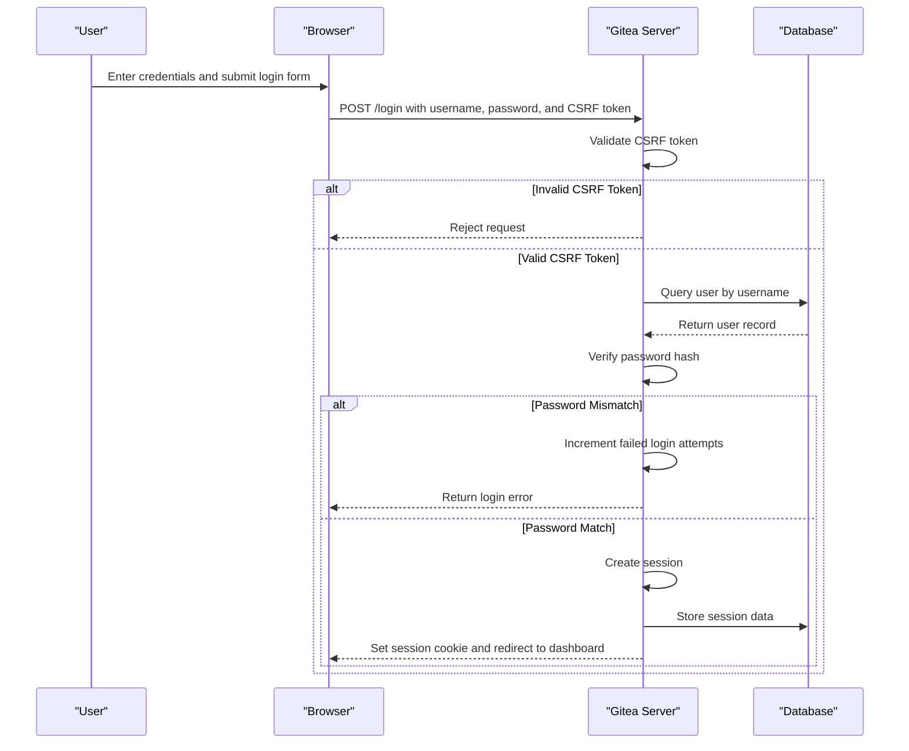
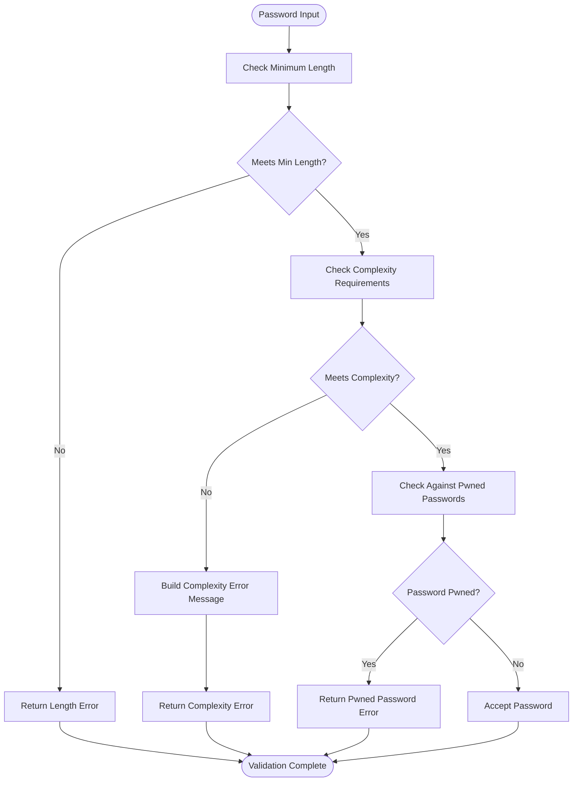
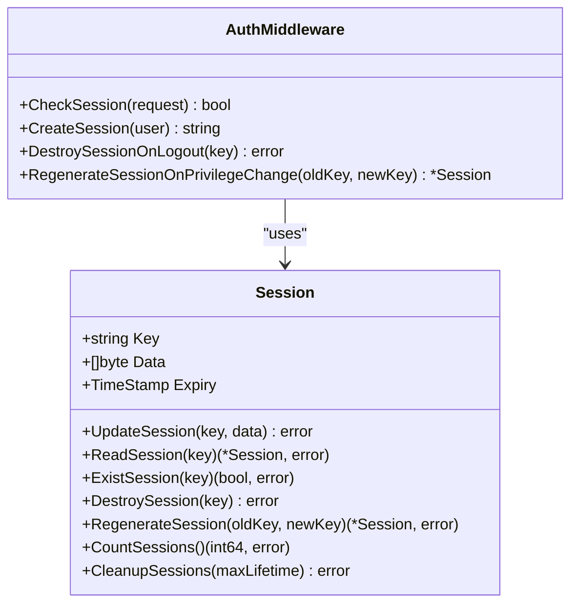

# Password Authentication

<cite>
**Referenced Files in This Document**   
- [password.go](file://modules/auth/password/password.go)
- [session.go](file://models/auth/session.go)
- [security.go](file://modules/setting/security.go)
- [app.ini](file://docker/root/etc/templates/app.ini)
</cite>

## Table of Contents
1. [Introduction](#introduction)
2. [Form-Based Login Flow](#form-based-login-flow)
3. [Password Validation and Complexity](#password-validation-and-complexity)
4. [Session Management and Middleware](#session-management-and-middleware)
5. [Security Considerations](#security-considerations)
6. [Configuration Options](#configuration-options)
7. [Conclusion](#conclusion)

## Introduction
Gitea implements a robust password-based authentication system that handles user login, session creation, and security enforcement through a modular architecture. The system ensures secure authentication by combining form-based login with CSRF protection, secure password hashing, and session management. This document details the implementation of password authentication in Gitea, focusing on the flow from authentication form submission to session creation, the role of middleware in route protection, and the configuration options that govern authentication behavior.

## Form-Based Login Flow

The form-based login process in Gitea begins with the submission of user credentials through an authentication form. Upon submission, the system validates the provided username and password against stored user data. The login flow incorporates CSRF protection to prevent cross-site request forgery attacks, ensuring that authentication requests originate from legitimate sources. Once credentials are validated, a session is created for the authenticated user, allowing them to access protected resources without re-authenticating for each request.

The authentication process leverages the `auth.Middleware` to protect routes, ensuring that only authenticated users can access specific endpoints. This middleware checks for valid session data on each request, redirecting unauthenticated users to the login page. The session lifecycle is managed through creation, renewal, and destruction operations, providing a secure and seamless user experience.



**Diagram sources**
- [password.go](file://modules/auth/password/password.go)
- [session.go](file://models/auth/session.go)

**Section sources**
- [password.go](file://modules/auth/password/password.go#L0-L136)
- [session.go](file://models/auth/session.go#L0-L112)

## Password Validation and Complexity

Gitea enforces password complexity requirements through the `modules/auth/password` package, which provides functions for validating password strength and generating secure passwords. The `IsComplexEnough` function checks whether a password meets the configured complexity requirements, which can include lowercase letters, uppercase letters, digits, and special characters. These requirements are defined in the `PasswordComplexity` setting and are applied during user registration and password changes.

The `BuildComplexityError` function generates user-friendly error messages that list the required complexity rules when a password fails validation. This helps users understand the requirements and create stronger passwords. Additionally, Gitea supports password generation through the `Generate` function, which creates random passwords that meet the configured complexity and length requirements.



**Diagram sources**
- [password.go](file://modules/auth/password/password.go)

**Section sources**
- [password.go](file://modules/auth/password/password.go#L0-L136)

## Session Management and Middleware

Session management in Gitea is handled through the `models/auth/session` package, which provides functions for creating, reading, updating, and destroying sessions. The `Session` struct stores session data with a unique key, expiry timestamp, and serialized session data. Sessions are stored in the database, allowing for persistence across server restarts and scalability in clustered environments.

The `auth.Middleware` plays a crucial role in protecting routes by verifying the presence and validity of session data on each request. When a user accesses a protected route, the middleware checks for a valid session cookie and retrieves the corresponding session data from the database. If the session is valid, the request proceeds; otherwise, the user is redirected to the login page.

Session lifecycle management includes features such as session regeneration to prevent session fixation attacks and automatic cleanup of expired sessions. The `RegenerateSession` function allows for the creation of a new session key while preserving session data, enhancing security during privilege changes or prolonged user activity.



**Diagram sources**
- [session.go](file://models/auth/session.go)

**Section sources**
- [session.go](file://models/auth/session.go#L0-L112)

## Security Considerations

Gitea implements several security measures to protect against common authentication vulnerabilities. Password hashing is performed using configurable algorithms, with support for modern hashing functions that provide strong protection against brute force attacks. The system can be configured to check passwords against known pwned password databases, preventing the use of compromised credentials.

Account lockout mechanisms help prevent brute force attacks by limiting the number of failed login attempts. After a configurable number of failures, accounts can be temporarily locked or require additional verification. Password complexity requirements ensure that users create strong passwords that are resistant to guessing and dictionary attacks.

Secure session storage is achieved through the use of HTTP-only cookies, which prevent client-side scripts from accessing session data and reduce the risk of cross-site scripting (XSS) attacks. Sessions have configurable expiration times, and expired sessions are automatically cleaned up to minimize the attack surface.

## Configuration Options

Gitea's authentication behavior is controlled through configuration options in the `app.ini` file, particularly in the `[security]` section. These options allow administrators to customize password policies, session settings, and security features to meet their organization's requirements.

### Password Policy Configuration
The following configuration options in `app.ini` control password policies:

| Key | Default | Description |
| --- | ------- | ----------- |
| MIN_PASSWORD_LENGTH | 8 | Minimum length required for passwords |
| PASSWORD_COMPLEXITY | off | Comma-separated list of complexity requirements (lower, upper, digit, spec) |
| PASSWORD_HASH_ALGO | argon2 | Password hashing algorithm (argon2, pbkdf2, scrypt, bcrypt) |
| PASSWORD_CHECK_PWN | false | Enable checking passwords against pwned password databases |

### Session and Security Configuration
Additional security-related configuration options include:

| Key | Default | Description |
| --- | ------- | ----------- |
| LOGIN_REMEMBER_DAYS | 31 | Number of days to remember user logins |
| CSRF_COOKIE_HTTP_ONLY | true | Set HTTP-only flag on CSRF cookies |
| DISABLE_QUERY_AUTH_TOKEN | false | Disable authentication via query parameters |
| TWO_FACTOR_AUTH | | Two-factor authentication enforcement (off, enforced) |

Example configuration in `app.ini`:
```ini
[security]
MIN_PASSWORD_LENGTH = 12
PASSWORD_COMPLEXITY = lower,upper,digit,spec
PASSWORD_HASH_ALGO = argon2
PASSWORD_CHECK_PWN = true
LOGIN_REMEMBER_DAYS = 7
CSRF_COOKIE_HTTP_ONLY = true
```

**Section sources**
- [security.go](file://modules/setting/security.go#L0-L185)
- [app.ini](file://docker/root/etc/templates/app.ini#L0-L62)

## Conclusion
Gitea's password-based authentication system provides a comprehensive and secure solution for user authentication. By combining form-based login with CSRF protection, strong password hashing, and robust session management, Gitea ensures that user credentials are protected against common security threats. The system's modular design and extensive configuration options allow administrators to tailor authentication behavior to their specific security requirements, making Gitea a reliable choice for organizations that prioritize security in their code hosting platform.