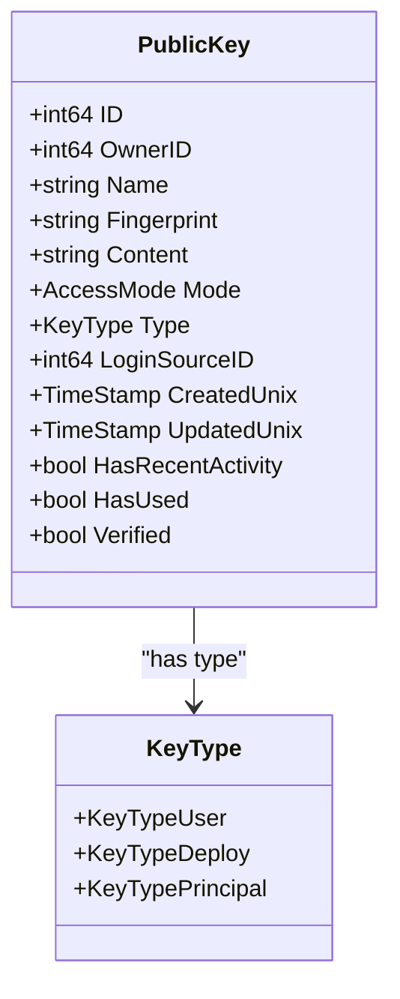
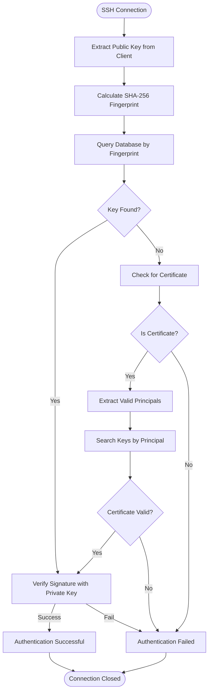
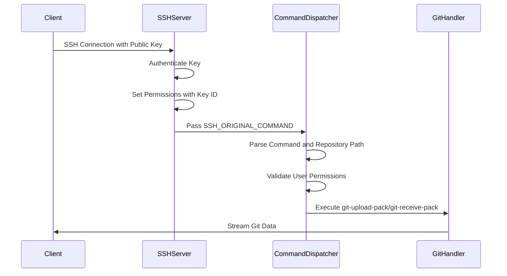
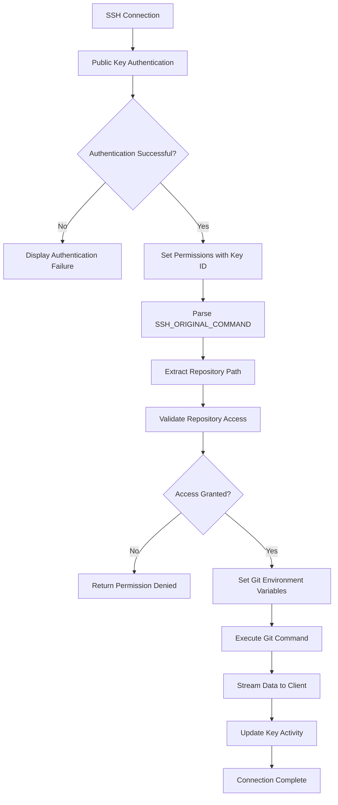

# SSH Key Authentication

<cite>
**Referenced Files in This Document**   
- [cmd/serv.go](file://cmd/serv.go)
- [models/asymkey/ssh_key.go](file://models/asymkey/ssh_key.go)
- [models/asymkey/ssh_key_parse.go](file://models/asymkey/ssh_key_parse.go)
- [modules/ssh/ssh.go](file://modules/ssh/ssh.go)
</cite>

## Table of Contents
1. [Introduction](#introduction)
2. [SSH Public Key Infrastructure](#ssh-public-key-infrastructure)
3. [Key Registration and Storage](#key-registration-and-storage)
4. [Key Lookup Mechanisms](#key-lookup-mechanisms)
5. [SSH Command Dispatching System](#ssh-command-dispatching-system)
6. [Authentication and Authorization Flow](#authentication-and-authorization-flow)
7. [Security Considerations](#security-considerations)
8. [Troubleshooting Common SSH Issues](#troubleshooting-common-ssh-issues)
9. [Configuration Requirements](#configuration-requirements)

## Introduction
This document provides a comprehensive overview of SSH key authentication in Gitea, focusing on Git operations. It details the SSH public key infrastructure, including key registration, storage, and lookup mechanisms. The document also covers the SSH command dispatching system that authenticates users based on their public keys and routes requests to appropriate handlers such as git-upload-pack and git-receive-pack. Examples from serv.go illustrate how SSH sessions are authenticated and authorized. Security considerations include key format support, passphrase protection, and revocation procedures. Additionally, troubleshooting guidance is provided for common SSH connection issues and configuration requirements for SSH daemons.

## SSH Public Key Infrastructure
Gitea implements a robust SSH public key infrastructure to secure Git operations. The system relies on asymmetric cryptography where users generate key pairs consisting of a private key (kept secret) and a public key (shared with Gitea). When a user attempts to connect via SSH, the server verifies the user's identity by challenging them to prove ownership of the private key corresponding to a registered public key.

The infrastructure supports multiple key types including RSA, ECDSA, ED25519, and their respective SK (Security Key) variants. Each public key is stored with metadata such as fingerprint, name, and access mode. The system also supports certificate-based authentication where trusted certificate authorities can issue certificates for users.

**Section sources**
- [models/asymkey/ssh_key.go](file://models/asymkey/ssh_key.go#L1-L50)
- [modules/ssh/ssh.go](file://modules/ssh/ssh.go#L31-L64)

## Key Registration and Storage
Public keys are registered through Gitea's web interface or API and stored in the database with associated metadata. The key registration process involves parsing and validating the public key format before storing it. Keys are stored in the `public_key` table with fields for ID, owner ID, name, fingerprint, content, access mode, type, and timestamps.

When a key is added, Gitea calculates its fingerprint using SHA-256 and stores it for quick lookup. The system also maintains an authorized_keys file on the server filesystem, which contains all active public keys in OpenSSH format. This file is updated whenever keys are added or removed.

The storage mechanism ensures that each user's keys are isolated by owner ID, and deploy keys are associated with specific repositories rather than users. The system also supports externally managed keys through authentication sources like LDAP.

**Diagram sources**
- [models/asymkey/ssh_key.go](file://models/asymkey/ssh_key.go#L45-L90)

**Section sources**
- [models/asymkey/ssh_key.go](file://models/asymkey/ssh_key.go#L100-L200)

## Key Lookup Mechanisms
Gitea employs multiple mechanisms for key lookup during authentication. The primary method involves searching by key content fingerprint, which provides a fast and secure way to identify registered keys. The system uses SHA-256 fingerprints as the default method for key identification.

When an SSH connection is established, the server receives the public key from the client and calculates its fingerprint. This fingerprint is then used to query the database for a matching public key record. The lookup process first attempts an exact match on the full key content, then falls back to prefix matching for compatibility with various key formats.

For certificate-based authentication, the system extracts valid principals from the certificate and searches for matching public keys by content. This allows certificate authorities to issue certificates for specific user identities that can be verified against registered keys.

**Diagram sources**
- [models/asymkey/ssh_key.go](file://models/asymkey/ssh_key.go#L200-L300)
- [modules/ssh/ssh.go](file://modules/ssh/ssh.go#L100-L150)

## SSH Command Dispatching System
The SSH command dispatching system in Gitea routes authenticated requests to appropriate handlers based on the requested Git operation. When a user connects via SSH, the system intercepts the SSH_ORIGINAL_COMMAND environment variable to determine the intended operation.

The dispatching mechanism supports standard Git operations including git-upload-pack (for cloning and fetching) and git-receive-pack (for pushing). The system parses the command arguments to extract the repository path and operation type, then validates the user's access permissions before executing the appropriate Git command.

The command dispatcher also handles special cases such as LFS (Large File Storage) operations and AGit flow protocols. For LFS operations, the system can authenticate transfer requests and provide temporary access tokens. The dispatcher ensures that all operations are properly logged and monitored for security purposes.

**Diagram sources**
- [cmd/serv.go](file://cmd/serv.go#L133-L198)
- [modules/ssh/ssh.go](file://modules/ssh/ssh.go#L101-L157)

## Authentication and Authorization Flow
The authentication and authorization flow in Gitea's SSH system follows a multi-step process that ensures secure access to repositories. When an SSH connection is established, the system first verifies the public key against stored keys in the database. Upon successful authentication, the system sets permissions that include the key ID as an extension.

The authorization process then determines the user's access level to the requested repository based on the key type and associated permissions. User keys grant access according to the user's repository permissions, while deploy keys provide access based on their configured read/write permissions for specific repositories.

The system uses the key ID to retrieve the corresponding user and repository access information, then sets environment variables for the Git process including the pusher name, email, and ID. This information is used to properly attribute Git operations to the authenticated user.

**Diagram sources**
- [cmd/serv.go](file://cmd/serv.go#L133-L345)
- [modules/ssh/ssh.go](file://modules/ssh/ssh.go#L101-L229)

## Security Considerations
Gitea implements several security measures to protect SSH key authentication. The system enforces minimum key size requirements to prevent weak keys from being used. Supported key types include RSA (minimum 1024 bits), ECDSA (256, 384, 521 bits), and ED25519 (256 bits).

The system validates key formats using the golang SSH library to ensure they conform to RFC4253 standards. It supports various key formats including OpenSSH, SSH2, and PEM, converting them to a standardized format for storage and comparison.

For passphrase protection, Gitea relies on the client-side implementation as the private key never leaves the user's machine. The system does not store or have access to private keys, only public keys and their metadata.

Key revocation is handled through the web interface or API, where users can remove keys they no longer need. When a key is deleted, it is removed from both the database and the authorized_keys file. The system also supports automatic key expiration based on usage patterns, marking inactive keys for potential cleanup.

**Section sources**
- [models/asymkey/ssh_key_parse.go](file://models/asymkey/ssh_key_parse.go#L1-L247)
- [models/asymkey/ssh_key.go](file://models/asymkey/ssh_key.go#L300-L400)

## Troubleshooting Common SSH Issues
Common SSH connection issues in Gitea typically fall into several categories. Connection refused errors often indicate that the SSH server is not running or is configured on a non-standard port. Users should verify that the SSH service is enabled in Gitea's configuration and that the port is accessible through any firewalls.

Authentication failures can occur due to mismatched key formats, incorrect key registration, or permission issues. Users should ensure they are using the public key (not private key) when registering and that the key format is supported. The system logs can provide detailed information about authentication attempts, including fingerprint verification.

Permission denied errors after successful authentication usually indicate repository access issues. Users should verify they have the necessary permissions for the requested repository and that the repository path in the Git URL is correct. The system's debug mode can provide additional information about command parsing and permission checking.

Other common issues include:
- Incorrect SSH URL format (should be git@hostname:username/repo.git)
- Key not added to SSH agent (use ssh-add)
- Host key verification failures (check ~/.ssh/known_hosts)
- Certificate authority trust issues (verify CA keys are properly configured)

**Section sources**
- [cmd/serv.go](file://cmd/serv.go#L164-L198)
- [modules/ssh/ssh.go](file://modules/ssh/ssh.go#L201-L229)

## Configuration Requirements
Proper configuration of SSH daemons and Gitea settings is essential for secure operation. The SSH server must be configured with appropriate ciphers, key exchange algorithms, and MACs to ensure secure connections. Gitea generates host keys automatically if they don't exist, but administrators can provide their own keys for better control.

The system requires the SSH server user to be set correctly in the configuration, typically "git" as the built-in server user. The authorized_keys file must be writable by the Gitea process to allow key updates. Repository paths should be properly configured with correct permissions to prevent unauthorized access.

For high-security environments, administrators can configure trusted certificate authorities and enforce minimum key sizes. The system also supports configuring multiple host keys and specifying allowed key types to meet organizational security policies.

**Section sources**
- [modules/ssh/ssh.go](file://modules/ssh/ssh.go#L300-L440)
- [cmd/serv.go](file://cmd/serv.go#L133-L162)