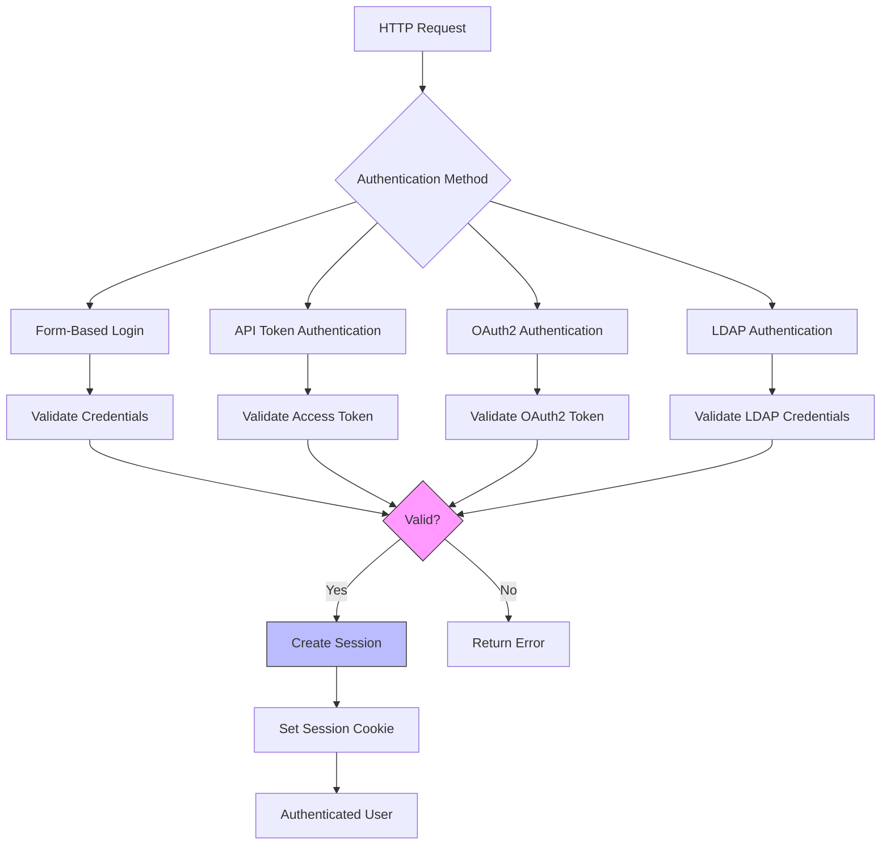
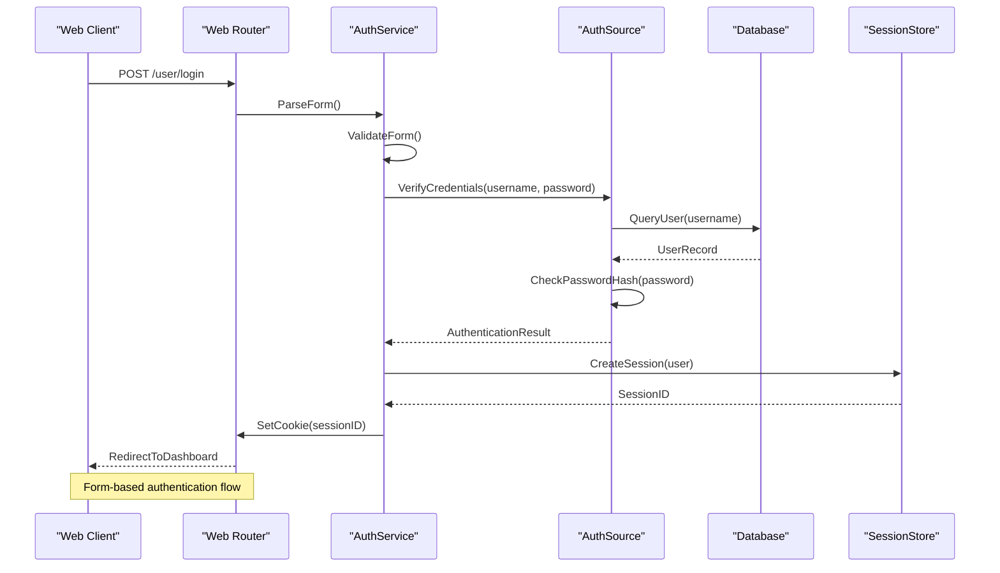
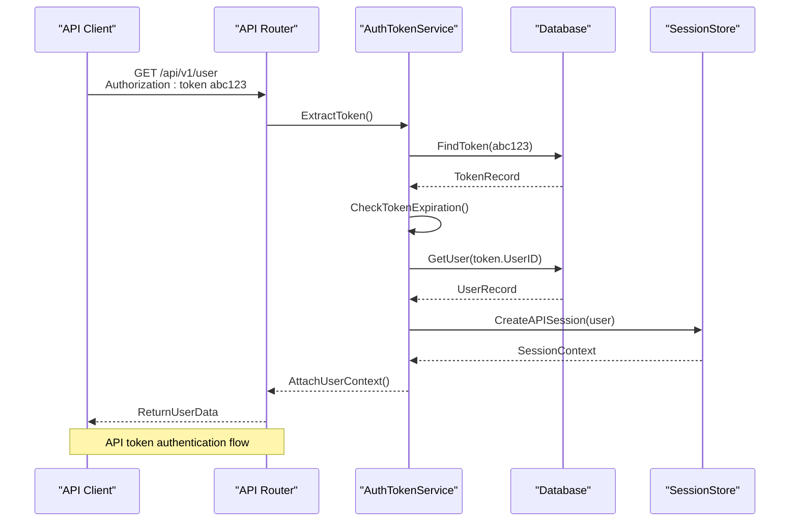
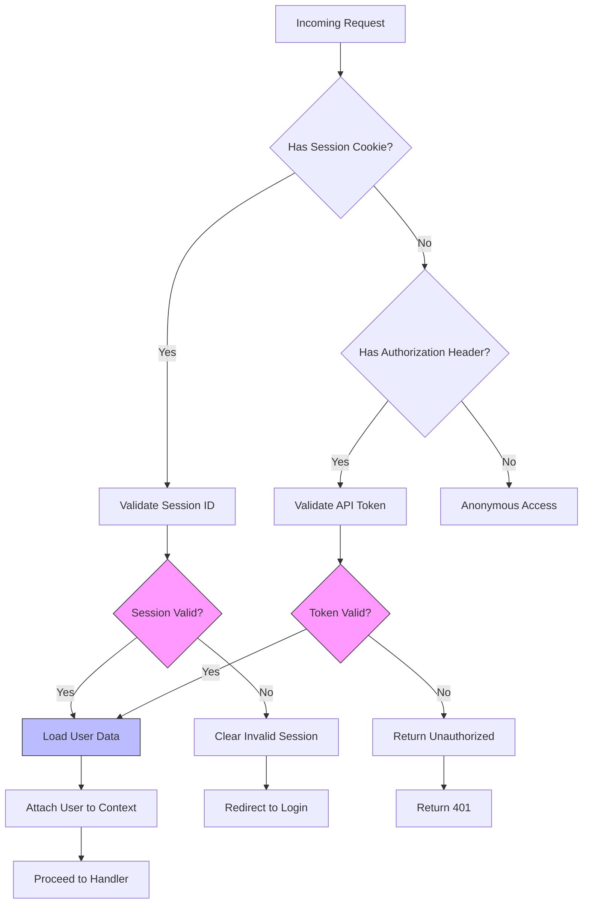
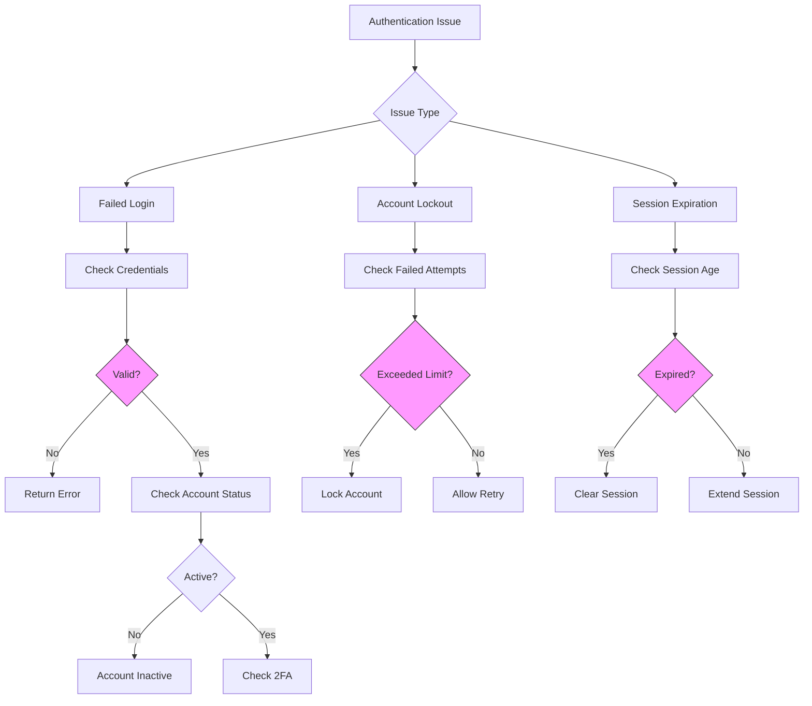
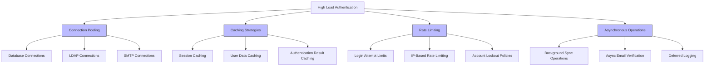
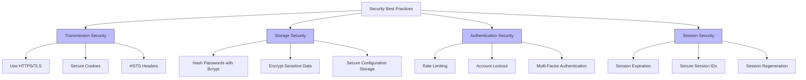

# User Authentication

<cite>
**Referenced Files in This Document**   
- [interface.go](file://services/auth/interface.go)
- [signin.go](file://services/auth/signin.go)
- [auth.go](file://models/auth/auth_token.go)
- [session.go](file://models/auth/session.go)
- [source.go](file://models/auth/source.go)
- [common.go](file://modules/auth/common.go)
</cite>

## Table of Contents
1. [Introduction](#introduction)
2. [Authentication Flow Overview](#authentication-flow-overview)
3. [Authentication Interface and Implementation](#authentication-interface-and-implementation)
4. [Form-Based and API Authentication](#form-based-and-api-authentication)
5. [Session Management and Middleware](#session-management-and-middleware)
6. [Authentication Sources](#authentication-sources)
7. [Common Authentication Issues](#common-authentication-issues)
8. [Performance Considerations](#performance-considerations)
9. [Security Best Practices](#security-best-practices)

## Introduction
Gitea provides a robust and extensible user authentication system that supports multiple authentication methods including database, LDAP, OAuth2, PAM, and SMTP. The system is designed to handle both form-based authentication for web users and token-based authentication for API clients. This document details the authentication flow from HTTP request to session creation, covering the core interfaces, implementations, and security considerations.

## Authentication Flow Overview



**Diagram sources**
- [signin.go](file://services/auth/signin.go)
- [auth.go](file://models/auth/auth_token.go)

**Section sources**
- [signin.go](file://services/auth/signin.go)
- [auth.go](file://models/auth/auth_token.go)

## Authentication Interface and Implementation

The authentication system in Gitea is built around a pluggable interface defined in `services/auth/interface.go`. This interface allows for multiple authentication methods to be implemented and used simultaneously.

```mermaid
classDiagram
class Method {
+Verify(request *http.Request, w http.ResponseWriter, store DataStore, sess SessionStore) (*User, error)
+Name() string
}
class PasswordAuthenticator {
+Authenticate(ctx context.Context, user *User, login, password string) (*User, error)
}
class SynchronizableSource {
+Sync(ctx context.Context, updateExisting bool) error
}
class SessionStore {
// Implementation of session.Store
}
Method <|-- LDAPAuth
Method <|-- OAuth2Auth
Method <|-- DBAuth
Method <|-- SMTPAuth
Method <|-- PAMAuth
Method <|-- SSPIAuth
PasswordAuthenticator <|-- LDAPAuth
PasswordAuthenticator <|-- DBAuth
PasswordAuthenticator <|-- SMTPAuth
PasswordAuthenticator <|-- PAMAuth
SynchronizableSource <|-- LDAPAuth
SynchronizableSource <|-- OAuth2Auth
note right of Method
Core interface for all authentication methods
Verify() handles the authentication logic
end
note right of PasswordAuthenticator
Interface for password-based authentication
Used by DB, LDAP, SMTP, and PAM methods
end
```

**Diagram sources**
- [interface.go](file://services/auth/interface.go)
- [source.go](file://models/auth/source.go)

**Section sources**
- [interface.go](file://services/auth/interface.go)
- [source.go](file://models/auth/source.go)

## Form-Based and API Authentication

Gitea supports both form-based authentication for web interfaces and token-based authentication for API clients. The system uses a unified authentication pipeline that can handle both types of requests.





**Diagram sources**
- [signin.go](file://services/auth/signin.go)
- [auth.go](file://models/auth/auth_token.go)

**Section sources**
- [signin.go](file://services/auth/signin.go)
- [auth.go](file://models/auth/auth_token.go)

## Session Management and Middleware

The session management system in Gitea is responsible for maintaining user sessions after successful authentication. The `auth.Middleware` component plays a crucial role in authenticating users on each request.



**Diagram sources**
- [session.go](file://models/auth/session.go)
- [common.go](file://modules/auth/common.go)

**Section sources**
- [session.go](file://models/auth/session.go)
- [common.go](file://modules/auth/common.go)

## Authentication Sources

Gitea supports multiple authentication sources, each implementing the common authentication interface. The `Source` type in `models/auth/source.go` defines the structure for authentication sources.

```mermaid
classDiagram
class Source {
+ID int64
+Type Type
+Name string
+IsActive bool
+IsSyncEnabled bool
+TwoFactorPolicy string
+Cfg Config
+CreatedUnix TimeStamp
+UpdatedUnix TimeStamp
}
class Config {
<<interface>>
+SetAuthSource(*Source)
}
class LDAPConfig {
+BindDN string
+BindPassword string
+UserSearchBase string
+UserFilter string
+GroupSearchBase string
}
class OAuth2Config {
+ClientID string
+ClientSecret string
+TokenURL string
+AuthURL string
+ProfileURL string
+Scopes string
}
class SMTPConfig {
+Host string
+Port int
+SecurityProtocol int
+SkipVerify bool
}
class PAMConfig {
+ServiceName string
+EmailDomain string
}
Source --> Config : "has"
Config <|-- LDAPConfig
Config <|-- OAuth2Config
Config <|-- SMTPConfig
Config <|-- PAMConfig
note right of Source
Base structure for all authentication sources
Type determines the authentication method
end
note right of Config
Interface for authentication-specific configuration
Implemented by each authentication method
end
```

**Diagram sources**
- [source.go](file://models/auth/source.go)
- [interface.go](file://services/auth/interface.go)

**Section sources**
- [source.go](file://models/auth/source.go)
- [interface.go](file://services/auth/interface.go)

## Common Authentication Issues

This section addresses common issues encountered during the authentication process, including failed logins, account lockouts, and session expiration.



**Section sources**
- [signin.go](file://services/auth/signin.go)
- [session.go](file://models/auth/session.go)

## Performance Considerations

When handling authentication under high load, several performance considerations must be addressed to maintain system responsiveness and security.



**Section sources**
- [common.go](file://modules/auth/common.go)
- [session.go](file://models/auth/session.go)

## Security Best Practices

This section outlines security best practices for protecting credentials during transmission and storage in the Gitea authentication system.



**Section sources**
- [common.go](file://modules/auth/common.go)
- [session.go](file://models/auth/session.go)
- [source.go](file://models/auth/source.go)