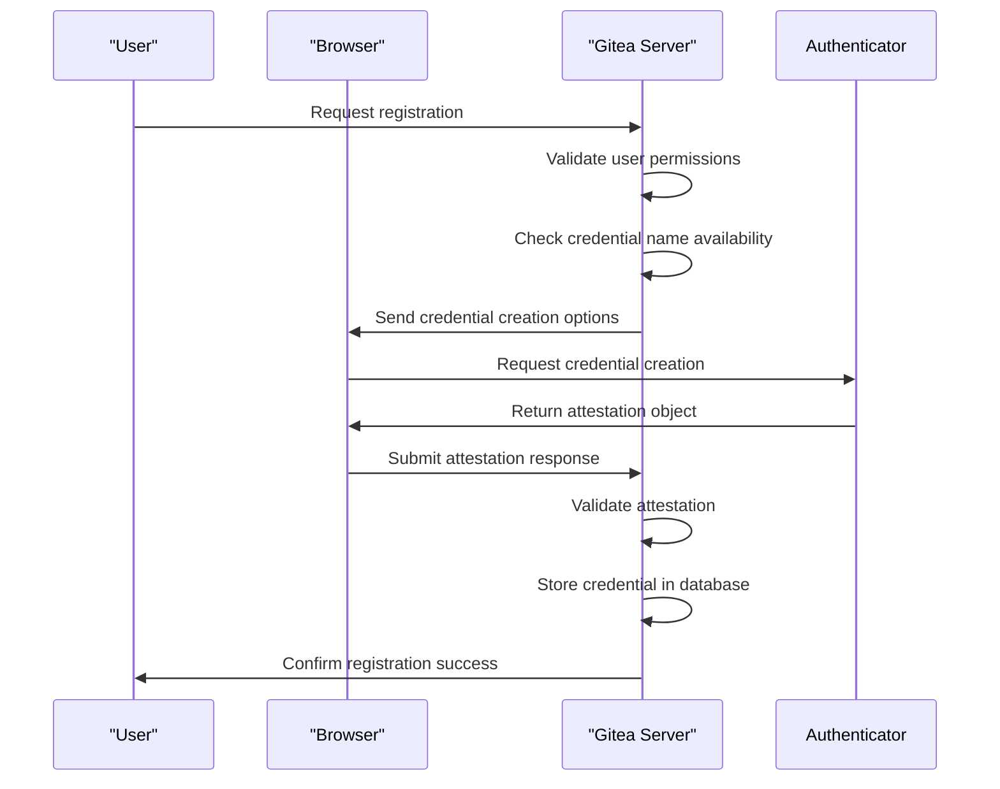
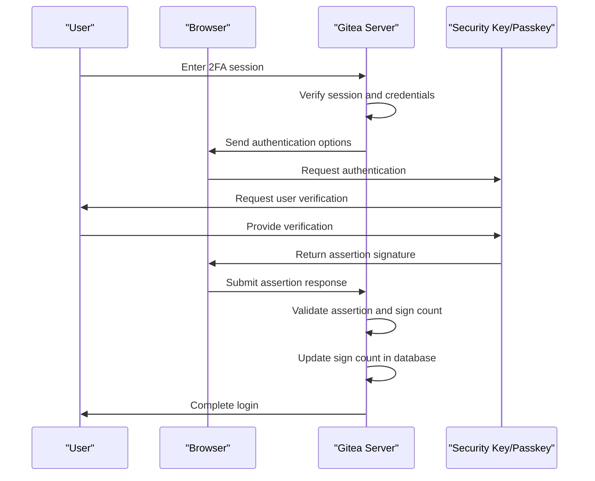
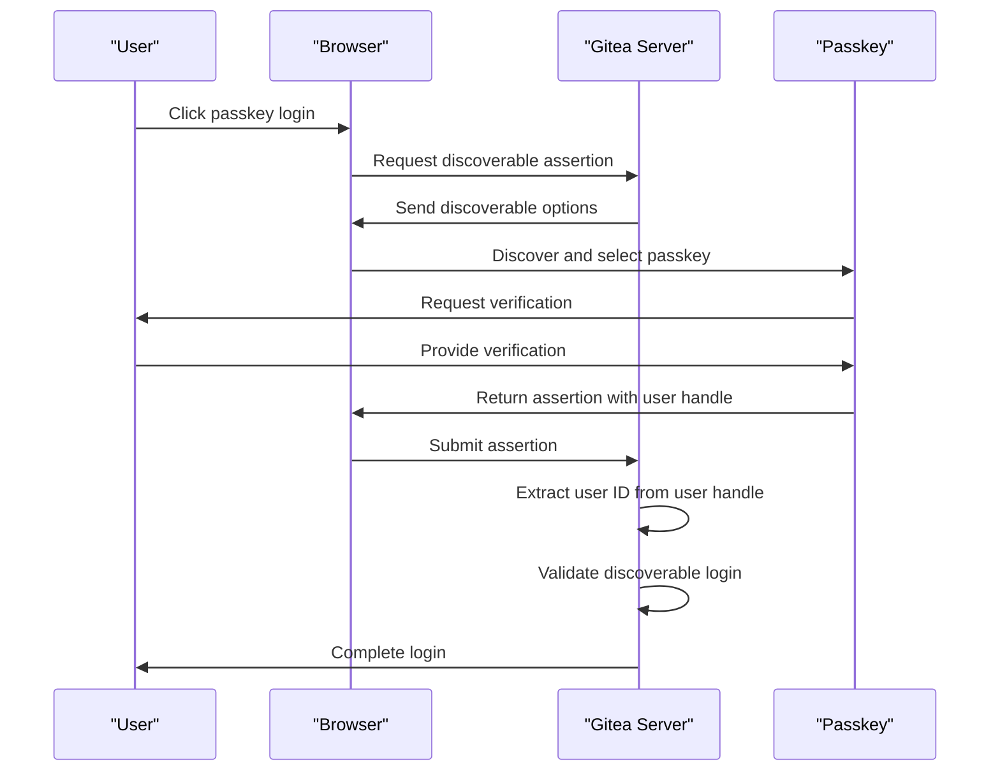
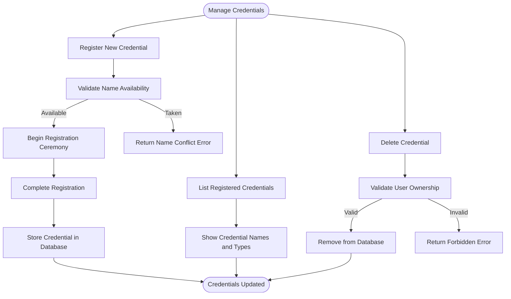
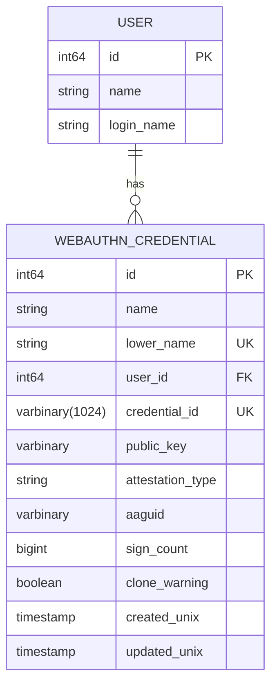
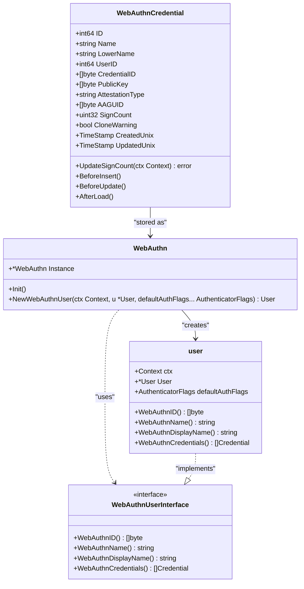

# WebAuthn Authentication

<cite>
**Referenced Files in This Document**   
- [webauthn.go](file://models/auth/webauthn.go)
- [webauthn.go](file://modules/auth/webauthn/webauthn.go)
- [webauthn.go](file://routers/web/auth/webauthn.go)
- [security/webauthn.go](file://routers/web/user/setting/security/webauthn.go)
- [user-auth-webauthn.ts](file://web_src/js/features/user-auth-webauthn.ts)
- [webauthn_credential.yml](file://models/fixtures/webauthn_credential.yml)
</cite>

## Table of Contents
1. [Introduction](#introduction)
2. [WebAuthn Registration Flow](#webauthn-registration-flow)
3. [WebAuthn Authentication Flow](#webauthn-authentication-flow)
4. [Passkey Support](#passkey-support)
5. [Credential Management](#credential-management)
6. [Database Schema and Storage](#database-schema-and-storage)
7. [Security Considerations](#security-considerations)
8. [Configuration Options](#configuration-options)
9. [Browser Compatibility](#browser-compatibility)
10. [Recovery Scenarios](#recovery-scenarios)
11. [Implementation Details](#implementation-details)

## Introduction
Gitea implements WebAuthn/FIDO2 passwordless authentication, enabling users to securely authenticate using security keys and passkeys. This implementation follows the WebAuthn Level 1 standard, providing a robust passwordless authentication mechanism that enhances security while improving user experience. The system supports both resident (passkeys) and non-resident credentials, allowing users to register multiple authenticators for the same account. The implementation is built on the `go-webauthn/webauthn` library and integrates with Gitea's existing authentication framework.

## WebAuthn Registration Flow
The WebAuthn registration process in Gitea follows the standard WebAuthn ceremony for credential creation. When a user initiates registration through the security settings, the server generates a challenge and sends credential creation options to the browser. The process begins with the `WebAuthnRegister` handler, which validates that MFA management is enabled for the user and checks for name conflicts with existing credentials. The system then creates a WebAuthn user object and calls `BeginRegistration` to generate the credential options.

The registration requires resident keys by setting the `ResidentKeyRequirementRequired` authenticator selection parameter, ensuring that passkeys are created when supported by the authenticator. During registration, the authenticator generates a new key pair and returns an attestation object containing the public key and authenticator metadata. The browser sends this attestation to the server's `WebauthnRegisterPost` endpoint, where it is validated using `FinishRegistration`. Upon successful validation, the credential data is stored in the database with the user's specified name, and the user's two-factor authentication status is updated.

**Diagram sources**
- [security/webauthn.go](file://routers/web/user/setting/security/webauthn.go#L15-L141)
- [webauthn.go](file://modules/auth/webauthn/webauthn.go#L30-L80)

**Section sources**
- [security/webauthn.go](file://routers/web/user/setting/security/webauthn.go#L15-L141)
- [user-auth-webauthn.ts](file://web_src/js/features/user-auth-webauthn.ts#L229-L266)

## WebAuthn Authentication Flow
The WebAuthn authentication process in Gitea follows the standard assertion ceremony for verifying user identity. When a user attempts to log in with WebAuthn, they first authenticate with their primary credentials and enter a two-factor authentication session. The authentication flow begins with the `WebAuthnLoginAssertion` handler, which verifies the user's session and checks for registered WebAuthn credentials. If credentials exist, the server creates a WebAuthn user object and calls `BeginLogin` to generate authentication options.

The authentication options include a challenge and a list of allowed credential IDs for the user's registered authenticators. The browser sends these options to the authenticator, which prompts the user for verification (such as biometrics or PIN). The authenticator returns a signature over the challenge and authentication data, which the browser submits to the `WebAuthnLoginAssertionPost` endpoint. The server validates the response using `ValidateLogin`, verifies the signature, and checks the sign count to detect potential credential cloning. Upon successful validation, the sign count is updated in the database, and the user is logged in.

**Diagram sources**
- [webauthn.go](file://routers/web/auth/webauthn.go#L100-L284)
- [webauthn.go](file://modules/auth/webauthn/webauthn.go#L30-L80)

**Section sources**
- [webauthn.go](file://routers/web/auth/webauthn.go#L100-L284)
- [user-auth-webauthn.ts](file://web_src/js/features/user-auth-webauthn.ts#L87-L120)

## Passkey Support
Gitea supports passkey authentication through discoverable credentials, allowing users to sign in without needing to select a specific authenticator. The passkey authentication flow is initiated through the `WebAuthnPasskeyAssertion` handler, which calls `BeginDiscoverableLogin` to generate options for discoverable credentials. This process differs from standard WebAuthn login by not specifying allowed credentials, allowing the browser to automatically select an appropriate passkey.

When the user clicks the passkey login button, the browser requests the assertion options and presents them to available authenticators. The authenticator returns the user handle containing the user's ID, which is used to identify the account during validation. The `WebAuthnPasskeyLogin` handler processes the response by parsing the credential request and validating the discoverable login using the user handle from the authenticator data. This enables seamless passwordless authentication where the user can sign in with a single click, provided their device supports passkeys and the browser can discover the appropriate credential.

**Diagram sources**
- [webauthn.go](file://routers/web/auth/webauthn.go#L50-L98)
- [user-auth-webauthn.ts](file://web_src/js/features/user-auth-webauthn.ts#L6-L30)

**Section sources**
- [webauthn.go](file://routers/web/auth/webauthn.go#L50-L98)
- [user-auth-webauthn.ts](file://web_src/js/features/user-auth-webauthn.ts#L6-L30)

## Credential Management
Gitea provides comprehensive credential management functionality, allowing users to register, use, and delete multiple WebAuthn authenticators. Users can register multiple credentials with different names, enabling them to use various security keys or passkeys across different devices. The system prevents name conflicts by checking for existing credentials with the same name before registration.

The credential deletion functionality is implemented in the `WebauthnDelete` handler, which validates that the user has permission to manage MFA and verifies that the credential belongs to the user before deletion. This ensures that users can maintain their security by removing compromised or unused authenticators. The system also supports credential enumeration during authentication, presenting users with their registered authenticators when multiple options are available.

**Diagram sources**
- [security/webauthn.go](file://routers/web/user/setting/security/webauthn.go#L15-L141)
- [webauthn.go](file://models/auth/webauthn.go#L1-L212)

**Section sources**
- [security/webauthn.go](file://routers/web/user/setting/security/webauthn.go#L15-L141)
- [webauthn.go](file://models/auth/webauthn.go#L1-L212)

## Database Schema and Storage
WebAuthn credential data is stored in the `webauthn_credential` database table, which contains all necessary information for WebAuthn authentication and attestation. The schema includes fields for the credential ID, public key, attestation type, AAGUID (Authenticator Attestation GUID), sign count, and clone warning status. The credential ID is stored as a VARBINARY field to accommodate the variable-length identifier from the authenticator.

The storage implementation includes proper indexing on user ID and credential ID fields to optimize lookup performance during authentication. The system also maintains creation and update timestamps for audit purposes. When storing credentials, the system automatically converts the name to lowercase for case-insensitive lookups while preserving the original case for display purposes. The sign count is updated after each successful authentication to prevent replay attacks and detect potential credential cloning.

**Diagram sources**
- [webauthn.go](file://models/auth/webauthn.go#L1-L212)
- [webauthn_credential.yml](file://models/fixtures/webauthn_credential.yml#L1-L10)

**Section sources**
- [webauthn.go](file://models/auth/webauthn.go#L1-L212)
- [webauthn_credential.yml](file://models/fixtures/webauthn_credential.yml#L1-L10)

## Security Considerations
Gitea's WebAuthn implementation includes several security measures to protect against common threats and ensure the integrity of the authentication process. The system validates the sign count returned by the authenticator and updates it in the database after each successful authentication. If a subsequent authentication presents a sign count that is less than or equal to the stored value, the system sets the clone warning flag and rejects the authentication, indicating a potential cloned credential.

The implementation also verifies user presence through the authenticator flags, ensuring that each authentication requires active user interaction. For passkey authentication, the system extracts the user ID from the user handle in the authenticator data, preventing authentication to the wrong account. The challenge-response mechanism protects against replay attacks, and the use of secure contexts (HTTPS) ensures that authentication data cannot be intercepted in transit.

Additional security considerations include:
- Session protection for WebAuthn ceremonies
- Proper error handling that doesn't leak sensitive information
- Validation of authenticator data structure and integrity
- Protection against brute force attacks through standard rate limiting
- Secure storage of private key material (never stored on the server)

**Section sources**
- [webauthn.go](file://routers/web/auth/webauthn.go#L100-L284)
- [webauthn.go](file://models/auth/webauthn.go#L1-L212)

## Configuration Options
Gitea provides several configuration options for WebAuthn authentication through the application settings. The WebAuthn instance is initialized with the relying party display name, ID, and origins derived from the application URL configuration. The system supports configuration of user verification requirements through the authenticator selection parameters.

The `EnablePasskeyAuth` setting controls whether passkey authentication is available to users. The WebAuthn configuration also includes attestation preference, currently set to prefer direct attestation for enhanced security. Timeouts for WebAuthn ceremonies are managed through the underlying `go-webauthn/webauthn` library defaults, which can be customized if needed.

Additional configuration options include:
- Relying party display name (from AppName setting)
- Relying party ID (from Domain setting)
- Allowed origins (derived from AppURL)
- User verification requirement (currently set to discouraged)
- Attestation preference (currently set to prefer direct)

**Section sources**
- [webauthn.go](file://modules/auth/webauthn/webauthn.go#L30-L80)
- [setting.go](file://modules/setting/setting.go)

## Browser Compatibility
Gitea's WebAuthn implementation is designed to work with modern browsers that support the Web Authentication API. The JavaScript implementation includes feature detection to verify both secure context requirements and PublicKeyCredential availability before enabling WebAuthn functionality. Browsers that do not support WebAuthn will have the authentication options hidden or disabled.

The implementation uses URL-safe base64 encoding for data transmission between the browser and server, ensuring compatibility across different environments. The JavaScript code handles the conversion between ArrayBuffer and base64-encoded strings for the various WebAuthn data structures, including challenges, credential IDs, and cryptographic signatures.

Supported browsers include:
- Chrome (version 67+)
- Firefox (version 60+)
- Safari (version 13+)
- Edge (version 18+)
- Opera (version 54+)

The implementation gracefully degrades when WebAuthn is not available, falling back to other two-factor authentication methods.

**Section sources**
- [user-auth-webauthn.ts](file://web_src/js/features/user-auth-webauthn.ts#L1-L267)
- [webauthn.go](file://modules/auth/webauthn/webauthn.go#L30-L80)

## Recovery Scenarios
Gitea provides recovery mechanisms for WebAuthn authentication to prevent account lockout. Users can register multiple authenticators, providing redundancy in case one device is lost or damaged. The system also supports traditional two-factor authentication methods alongside WebAuthn, allowing users to authenticate with backup codes or TOTP if their primary authenticator is unavailable.

Administrators can assist with account recovery by managing authentication methods through the admin interface. Users can also remove compromised or lost authenticators through the security settings, provided they can authenticate through another method. The system does not automatically lock accounts after failed WebAuthn attempts, but standard rate limiting applies to prevent brute force attacks.

Recovery best practices include:
- Registering multiple authenticators on different devices
- Maintaining backup authentication methods
- Regularly reviewing registered authenticators
- Using passkeys for cross-device recovery
- Storing recovery codes securely

**Section sources**
- [webauthn.go](file://routers/web/auth/webauthn.go#L1-L284)
- [security/webauthn.go](file://routers/web/user/setting/security/webauthn.go#L15-L141)

## Implementation Details
The WebAuthn implementation in Gitea is structured across multiple layers, with clear separation of concerns between the models, modules, and routers. The core functionality is provided by the `go-webauthn/webauthn` library, which handles the cryptographic operations and protocol compliance. Gitea's implementation wraps this library with domain-specific logic for user management, credential storage, and session handling.

The `WebAuthnCredential` model represents the stored credential data and includes methods for database operations and data transformation. The `WebAuthn` module initializes the global WebAuthn instance and provides the user interface implementation that bridges Gitea's user model with the WebAuthn library requirements. The routers handle the HTTP endpoints for registration, authentication, and credential management, coordinating between the frontend JavaScript and backend services.

Key implementation details include:
- Proper handling of binary data through base64 encoding
- Secure session management for WebAuthn ceremonies
- Integration with Gitea's existing authentication framework
- Support for both resident and non-resident credentials
- Comprehensive error handling and logging
- Protection against timing attacks in credential validation

**Diagram sources**
- [webauthn.go](file://models/auth/webauthn.go#L1-L212)
- [webauthn.go](file://modules/auth/webauthn/webauthn.go#L30-L80)

**Section sources**
- [webauthn.go](file://models/auth/webauthn.go#L1-L212)
- [webauthn.go](file://modules/auth/webauthn/webauthn.go#L30-L80)