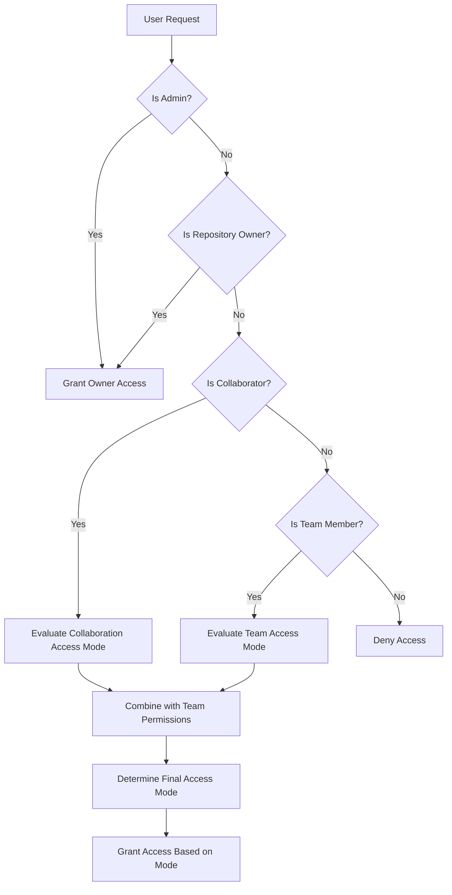
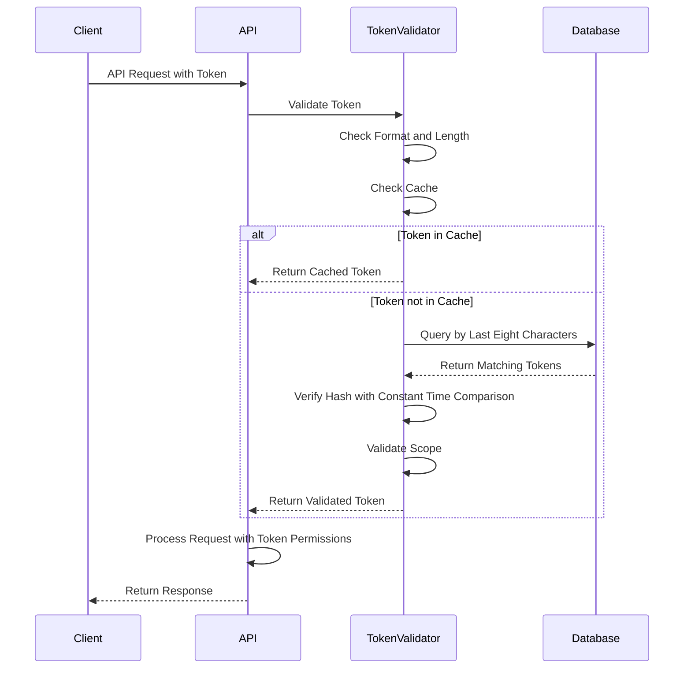
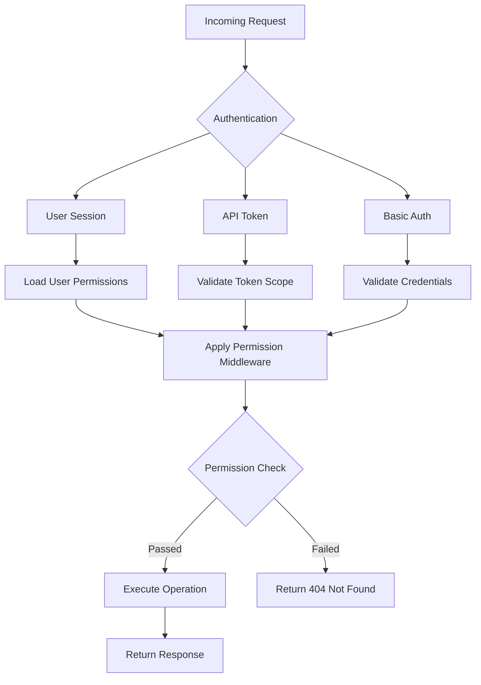
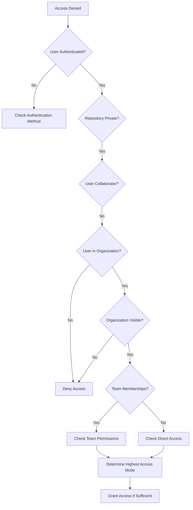

# User Authorization and Permissions

<cite>
**Referenced Files in This Document**   
- [repo_permission.go](file://models/perm/access/repo_permission.go)
- [access_token.go](file://models/auth/access_token.go)
- [permission.go](file://services/context/permission.go)
- [access.go](file://models/perm/access/access.go)
- [team.go](file://models/organization/team.go)
- [unit.go](file://models/unit/unit.go)
</cite>

## Table of Contents
1. [Introduction](#introduction)
2. [Repository Permission Model](#repository-permission-model)
3. [API Token-Based Authorization](#api-token-based-authorization)
4. [Permission Checks in Repository Operations](#permission-checks-in-repository-operations)
5. [User Accounts, Access Tokens, and Repository Units](#user-accounts-access-tokens-and-repository-units)
6. [Common Issues and Troubleshooting](#common-issues-and-troubleshooting)
7. [Performance Considerations](#performance-considerations)
8. [Conclusion](#conclusion)

## Introduction
Gitea implements a comprehensive user authorization system that governs access to repositories through multiple mechanisms. This document details the permission model, API token-based authorization, and the integration between user accounts, access tokens, and repository units. The system supports complex access control scenarios including direct collaboration, team membership, and organization roles, providing fine-grained control over repository operations.

## Repository Permission Model

Gitea's repository permission model is implemented in `models/perm/access/repo_permission.go` and provides a sophisticated system for determining user access rights to repositories. The model supports three primary access mechanisms: direct collaboration, team membership, and organization roles.

The `Permission` struct contains all the permissions-related variables for a repository and a user, including the access mode, repository units, and unit-specific access modes. The system evaluates permissions hierarchically, starting with the most privileged access and cascading down through various permission levels.

Users gain access to repositories through three primary mechanisms:

1. **Direct Collaboration**: Users can be directly added as collaborators to a repository with specific access modes (read, write, admin, or owner).
2. **Team Membership**: In organizations, users can gain access through team membership, where teams are granted specific permissions to repositories.
3. **Organization Roles**: Organization members can have different roles that determine their default access to repositories within the organization.

The permission evaluation process follows a specific order of precedence:
- Admin users have super access to all repositories
- Repository owners have owner-level access
- Team members with admin access override other team permissions
- Collaborator access modes are evaluated
- Team unit access modes are aggregated



**Diagram sources**
- [repo_permission.go](file://models/perm/access/repo_permission.go#L287-L332)
- [access.go](file://models/perm/access/access.go#L169-L208)

**Section sources**
- [repo_permission.go](file://models/perm/access/repo_permission.go#L209-L255)
- [access.go](file://models/perm/access/access.go#L169-L208)

## API Token-Based Authorization

Gitea implements API token-based authorization through the `models/auth/access_token.go` file, which defines the personal access token system. This system allows users to authenticate API requests using tokens with specific scopes and permissions.

The `AccessToken` struct represents a personal access token with properties including:
- ID and user ID for identification
- Name for user reference
- Token hash for secure storage
- Token last eight characters for indexing
- Scope defining the token's permissions

Token authentication follows a multi-step process:
1. The system first validates the token format and length
2. It checks the token against a cache for recently used tokens
3. If not in cache, it queries the database using the token's last eight characters
4. It verifies the token hash using cryptographic comparison
5. It validates the token's scope against the required permissions

The scope system implements a hierarchical permission model where tokens can have read, write, or admin access to specific categories of resources. The system uses a bitmap-based approach for efficient scope validation, allowing for quick determination of whether a token has the required permissions for a given operation.



**Diagram sources**
- [access_token.go](file://models/auth/access_token.go#L151-L193)
- [access_token_scope.go](file://models/auth/access_token_scope.go#L289-L346)

**Section sources**
- [access_token.go](file://models/auth/access_token.go#L151-L193)
- [access_token_scope.go](file://models/auth/access_token_scope.go#L289-L346)

## Permission Checks in Repository Operations

The `services/context/permission.go` file implements middleware functions for enforcing permission checks during repository operations. These functions are used throughout the application to ensure that users have the appropriate permissions before performing actions on repositories.

Key permission check functions include:

- `RequireRepoAdmin`: Middleware that requires repository admin permission
- `CanWriteToBranch`: Checks if the user can write to a specific branch
- `RequireUnitWriter`: Requires write permission to one of the specified repository units
- `RequireUnitReader`: Requires read permission to one of the specified repository units
- `CheckRepoScopedToken`: Validates that personal access tokens have the required repository scope

The permission checking system integrates with the authentication middleware to provide seamless authorization. When a request is made, the system first authenticates the user (or token), then applies the appropriate permission checks based on the requested operation.

For repository operations, the system evaluates permissions at the unit level. Repository units represent different functional areas such as code, issues, pull requests, wiki, and packages. Each unit can have different access modes, allowing for fine-grained control over repository features.



**Diagram sources**
- [permission.go](file://services/context/permission.go#L20-L95)
- [repo_permission.go](file://models/perm/access/repo_permission.go#L88-L114)

**Section sources**
- [permission.go](file://services/context/permission.go#L20-L95)
- [repo_permission.go](file://models/perm/access/repo_permission.go#L88-L114)

## User Accounts, Access Tokens, and Repository Units

The relationship between user accounts, access tokens, and repository units forms the foundation of Gitea's authorization system. This triad enables flexible and secure access control across the platform.

User accounts represent individual identities in the system and can have various roles:
- Regular users with personal repositories
- Organization members with access to organization resources
- Administrators with system-wide privileges

Access tokens serve as authentication credentials that can be used in place of passwords, particularly for API access. Each token is associated with a user account and has a specific scope that limits its permissions. Tokens can be scoped to public resources only or have broader access based on their permissions.

Repository units represent the functional components of a repository:
- Code: Source code management
- Issues: Issue tracking
- PullRequests: Pull request management
- Releases: Release management
- Wiki: Documentation
- Packages: Package registry
- Actions: CI/CD workflows

The permission system evaluates access by combining the user's account permissions, the token's scope (if applicable), and the repository unit's access requirements. This multi-dimensional approach allows for sophisticated access control policies that can accommodate complex organizational structures.

```mermaid
erDiagram
USER ||--o{ ACCESS_TOKEN : "has"
USER ||--o{ REPOSITORY : "owns"
ORGANIZATION ||--o{ TEAM : "has"
TEAM ||--o{ REPOSITORY : "accesses"
USER ||--o{ TEAM : "members"
REPOSITORY ||--o{ REPO_UNIT : "contains"
ACCESS_TOKEN }|--|| ACCESS_SCOPE : "has"
REPO_UNIT }|--|| UNIT_TYPE : "is"
class USER {
+int64 ID
+string Name
+bool IsAdmin
}
class ACCESS_TOKEN {
+int64 ID
+int64 UID
+string TokenHash
+string Scope
}
class REPOSITORY {
+int64 ID
+int64 OwnerID
+bool IsPrivate
}
class TEAM {
+int64 ID
+int64 OrgID
+AccessMode AccessMode
}
class REPO_UNIT {
+int64 ID
+int64 RepoID
+UnitType Type
+AccessMode AccessMode
}
```

**Diagram sources**
- [unit.go](file://models/unit/unit.go#L0-L377)
- [team.go](file://models/organization/team.go#L0-L249)
- [access_token.go](file://models/auth/access_token.go#L0-L236)

**Section sources**
- [unit.go](file://models/unit/unit.go#L0-L377)
- [team.go](file://models/organization/team.go#L0-L249)
- [access_token.go](file://models/auth/access_token.go#L0-L236)

## Common Issues and Troubleshooting

Several common issues can arise with Gitea's authorization system, particularly in complex organizational structures. Understanding these issues and their solutions is crucial for effective system administration.

### Permission Inheritance Issues
Permission inheritance can be problematic when users belong to multiple teams with conflicting permissions. The system resolves this by taking the highest access mode across all applicable teams. However, this can lead to unexpected access levels if not carefully managed.

To troubleshoot permission inheritance issues:
1. Verify the user's team memberships
2. Check the access mode of each team
3. Confirm the repository units enabled for each team
4. Use the `GetUserRepoPermission` function to debug the final calculated permissions

### Token Scope Limitations
API tokens with insufficient scope are a common source of access denial. Tokens may have read-only access when write access is required, or may be limited to public repositories when accessing private ones.

To resolve token scope issues:
1. Verify the token's scope matches the required permissions
2. Check if the token is restricted to public resources only
3. Ensure the token has the appropriate category permissions
4. Regenerate the token with the correct scope if necessary

### Access Denial Troubleshooting
When users are denied access to repositories, follow this diagnostic process:
1. Confirm the user is properly authenticated
2. Check if the repository is private and the user has explicit access
3. Verify the user's organization visibility settings
4. Examine team memberships and their permissions
5. Review direct collaboration status

The system logs detailed permission information that can be invaluable for troubleshooting. The `LogString` method of the `Permission` struct provides comprehensive details about the calculated permissions, including access modes for each repository unit.



**Diagram sources**
- [repo_permission.go](file://models/perm/access/repo_permission.go#L159-L207)
- [access_token.go](file://models/auth/access_token.go#L240-L294)

**Section sources**
- [repo_permission.go](file://models/perm/access/repo_permission.go#L159-L207)
- [access_token.go](file://models/auth/access_token.go#L240-L294)

## Performance Considerations

Permission checks in large organizations with complex team structures can impact system performance. The authorization system is designed to be efficient, but certain patterns can lead to performance bottlenecks.

Key performance considerations include:

### Database Query Optimization
The permission system performs multiple database queries to determine access rights:
- User and repository loading
- Collaboration status checking
- Team membership verification
- Unit permission aggregation

To optimize performance:
1. Ensure proper indexing on frequently queried fields
2. Use caching for frequently accessed permission data
3. Minimize the number of team memberships per user
4. Avoid deeply nested team structures

### Caching Strategies
The system implements caching at multiple levels:
- Successful access token cache to reduce database lookups
- Permission calculation results for frequently accessed repositories
- Team membership information

The cache size for successful tokens is configurable via the `SuccessfulTokensCacheSize` setting, allowing administrators to balance memory usage with performance.

### Scalability in Large Organizations
In organizations with many teams and repositories, permission calculations can become complex. The system handles this by:
- Processing team permissions in batches
- Using efficient data structures for permission aggregation
- Implementing short-circuit evaluation when higher privileges are found

For optimal performance in large organizations:
1. Limit the number of teams per user
2. Use organization-wide teams sparingly
3. Regularly review and clean up unused teams
4. Monitor permission check latency and optimize as needed

The system's performance is particularly important for API operations, where permission checks occur on every request. The bitmap-based scope validation system provides efficient permission checking even with complex scope requirements.

**Section sources**
- [repo_permission.go](file://models/perm/access/repo_permission.go#L287-L332)
- [access_token.go](file://models/auth/access_token.go#L151-L193)

## Conclusion
Gitea's user authorization system provides a robust and flexible framework for managing access to repositories. The system combines direct collaboration, team membership, and organization roles to create a comprehensive permission model that can accommodate complex organizational structures.

The API token-based authorization system enables secure programmatic access with fine-grained scope control, while the integration with repository units allows for detailed permission management across different repository features.

Understanding the relationships between user accounts, access tokens, and repository units is essential for effective system administration. By following best practices for permission management and addressing common issues proactively, organizations can ensure secure and efficient access to their repositories.

The performance considerations outlined in this document provide guidance for scaling the authorization system in large organizations, ensuring that permission checks remain efficient even with complex team structures and large numbers of repositories.