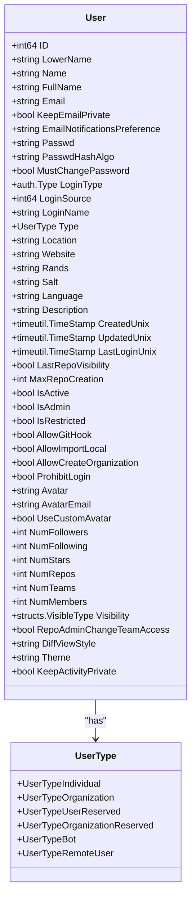
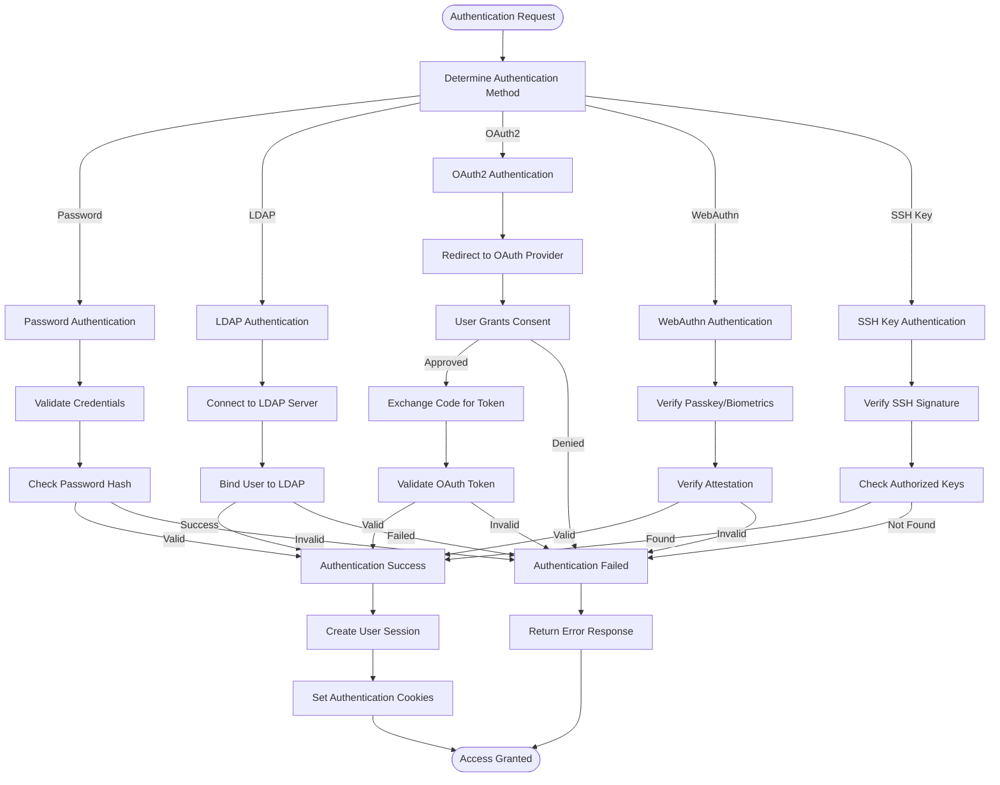
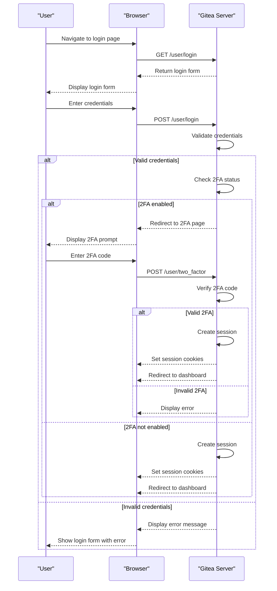
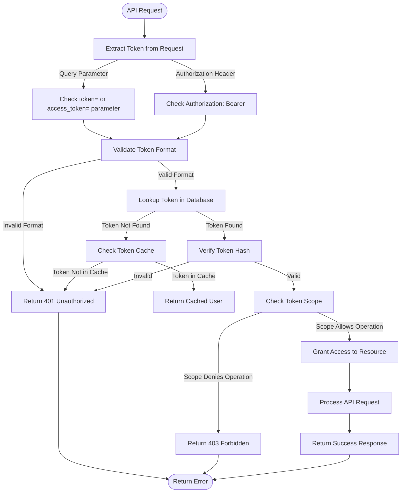

# User Management

<cite>
**Referenced Files in This Document**   
- [user.go](file://models/user/user.go)
- [auth.go](file://services/auth/auth.go)
- [oauth2.go](file://services/auth/oauth2.go)
- [access_token.go](file://models/auth/access_token.go)
- [session.go](file://models/auth/session.go)
- [source.go](file://models/auth/source.go)
- [webauthn.go](file://modules/auth/webauthn/webauthn.go)
- [auth.go](file://routers/web/auth/auth.go)
</cite>

## Table of Contents
1. [Introduction](#introduction)
2. [User Authentication and Authorization Architecture](#user-authentication-and-authorization-architecture)
3. [User Models and Data Structure](#user-models-and-data-structure)
4. [Authentication Methods and Workflows](#authentication-methods-and-workflows)
5. [User Registration and Login Flows](#user-registration-and-login-flows)
6. [API Token Usage and Access Control](#api-token-usage-and-access-control)
7. [User Account, Access Tokens, and Permissions](#user-account-access-tokens-and-permissions)
8. [Common Authentication Issues and Account Recovery](#common-authentication-issues-and-account-recovery)
9. [Performance Considerations and Security Best Practices](#performance-considerations-and-security-best-practices)

## Introduction
Gitea's user management system provides a robust and flexible framework for handling user identities, authentication, and authorization. This document comprehensively covers the architecture and implementation details of Gitea's user management, focusing on its support for multiple identity providers and various authentication methods. The system is designed to ensure secure access to repositories and services while providing administrators with comprehensive control over user permissions and account settings. This documentation will explore the core components, workflows, and security considerations that make Gitea's user management system both powerful and adaptable to different deployment scenarios.

## User Authentication and Authorization Architecture
Gitea implements a modular authentication and authorization architecture that supports multiple identity providers through a pluggable system. The architecture is designed to handle both local authentication and external identity providers, allowing seamless integration with existing enterprise identity systems. The authentication process is orchestrated through a series of middleware components that intercept requests and verify user credentials before granting access to protected resources. The system distinguishes between different authentication contexts, such as web interface access, API requests, and Git operations, applying appropriate authentication methods for each scenario. Authorization is handled through a role-based access control system that determines user permissions based on their account type, organization membership, and explicit permissions granted on repositories and resources.

**Section sources**
- [auth.go](file://services/auth/auth.go#L1-L155)
- [source.go](file://models/auth/source.go#L1-L398)

## User Models and Data Structure
The user model in Gitea is implemented in the `models/user/user.go` file and represents the core data structure for user accounts. The User struct contains comprehensive fields for storing user information, authentication credentials, and preferences. Key attributes include the user's unique identifier, username, email address, password hash, and various metadata such as creation and update timestamps. The model supports different user types, including individual users, organizations, and service accounts, through the UserType enumeration. The user model also includes fields for managing user visibility, repository creation limits, and interface preferences. The data structure is designed to support both local authentication and external identity providers, with fields for tracking the authentication source and login type.



**Diagram sources **
- [user.go](file://models/user/user.go#L1-L799)

**Section sources**
- [user.go](file://models/user/user.go#L1-L799)

## Authentication Methods and Workflows
Gitea supports multiple authentication methods, each with its own workflow and security characteristics. The primary authentication methods include password-based authentication, LDAP, OAuth2, WebAuthn (passkeys), and SSH keys. Password authentication uses modern hashing algorithms like Argon2 to securely store user credentials. LDAP integration allows organizations to use their existing directory services for user authentication. OAuth2 enables single sign-on with external identity providers such as GitHub, Google, or custom OAuth2 servers. WebAuthn provides passwordless authentication using security keys or biometric authentication through the browser's Web Authentication API. SSH key authentication is used for secure Git operations, allowing users to authenticate without entering passwords for each repository operation.



**Diagram sources **
- [auth.go](file://services/auth/auth.go#L1-L155)
- [oauth2.go](file://services/auth/oauth2.go#L1-L193)
- [webauthn.go](file://modules/auth/webauthn/webauthn.go#L1-L80)

**Section sources**
- [auth.go](file://services/auth/auth.go#L1-L155)
- [oauth2.go](file://services/auth/oauth2.go#L1-L193)
- [webauthn.go](file://modules/auth/webauthn/webauthn.go#L1-L80)

## User Registration and Login Flows
The user registration and login flows in Gitea are designed to provide a seamless experience while maintaining security best practices. The registration process begins with the user providing basic information such as username, email address, and password. The system validates the input against various constraints, including username availability, email format, and password complexity requirements. During registration, the system checks for blacklisted email domains and enforces minimum password length and complexity rules. For password security, Gitea integrates with the Have I Been Pwned service to detect compromised passwords. After successful registration, users may need to verify their email address before gaining full access to the system, depending on the server configuration.

The login flow supports multiple authentication methods and includes provisions for two-factor authentication. When a user attempts to log in, the system first determines the appropriate authentication method based on the provided credentials and server configuration. For password-based authentication, the system verifies the password hash against the stored value. If two-factor authentication is enabled, the user is redirected to a secondary authentication page after successful password verification. The login process also handles session management, creating secure session cookies and setting appropriate expiration times based on the "remember me" preference.



**Diagram sources **
- [auth.go](file://routers/web/auth/auth.go#L1-L799)

**Section sources**
- [auth.go](file://routers/web/auth/auth.go#L1-L799)

## API Token Usage and Access Control
Gitea's API token system provides a secure mechanism for programmatic access to the platform's functionality. API tokens are implemented in the `models/auth/access_token.go` file and represent long-lived credentials that can be used to authenticate API requests. Each token is associated with a specific user and has a defined scope that limits the operations it can perform. The token system uses cryptographic hashing to securely store token values in the database, with only the hash being stored and the original token value being available only when initially created. Tokens can be created, listed, and revoked through both the web interface and API endpoints, allowing users to manage their credentials effectively.

The access control system evaluates API tokens by first extracting the token from the request, either from query parameters or the Authorization header. The system then looks up the corresponding token record in the database and verifies its validity. For performance optimization, Gitea implements a cache for recently used tokens to reduce database queries. Once a token is validated, the system checks its scope to determine the level of access granted to the requesting application. This scoped access control ensures that API tokens have only the minimum permissions necessary for their intended use, following the principle of least privilege.



**Diagram sources **
- [access_token.go](file://models/auth/access_token.go#L1-L236)
- [oauth2.go](file://services/auth/oauth2.go#L1-L193)

**Section sources**
- [access_token.go](file://models/auth/access_token.go#L1-L236)
- [oauth2.go](file://services/auth/oauth2.go#L1-L193)

## User Account, Access Tokens, and Permissions
The relationship between user accounts, access tokens, and the permission system in Gitea forms the foundation of its security model. Each user account serves as the primary identity for accessing the platform, with various authentication methods linked to the same account. Access tokens are derived from user accounts and inherit the permissions of their parent user, but with potentially restricted scopes. The permission system implements a hierarchical model where users have direct permissions on repositories they own, and additional permissions through team memberships in organizations.

The system distinguishes between different types of users, including regular users, organization members, and service accounts, each with different permission profiles. Regular users can create repositories and participate in collaboration, while organization members have permissions based on their team roles. Service accounts, such as the built-in Actions user, have specific permissions tailored to their automated functions. The permission system also supports fine-grained access control at the repository level, allowing owners to grant read, write, or administrative access to other users and teams.

```mermaid
erDiagram
USER {
int64 id PK
string lower_name UK
string name UK
string email
string passwd_hash
auth.Type login_type
int64 login_source
UserType type
bool is_active
bool is_admin
bool is_restricted
}
ACCESS_TOKEN {
int64 id PK
int64 uid FK
string name
string token_hash UK
string token_last_eight
string scope
timestamp created_unix
timestamp updated_unix
}
REPOSITORY {
int64 id PK
int64 owner_id FK
string name
bool is_private
}
TEAM {
int64 id PK
int64 org_id FK
string name
string access_mode
}
TEAM_USER {
int64 team_id FK
int64 uid FK
}
USER ||--o{ ACCESS_TOKEN : "has"
USER ||--o{ REPOSITORY : "owns"
USER ||--o{ TEAM_USER : "member of"
TEAM ||--o{ TEAM_USER : "contains"
TEAM ||--|| REPOSITORY : "has access to"
```

**Diagram sources **
- [user.go](file://models/user/user.go#L1-L799)
- [access_token.go](file://models/auth/access_token.go#L1-L236)

**Section sources**
- [user.go](file://models/user/user.go#L1-L799)
- [access_token.go](file://models/auth/access_token.go#L1-L236)

## Common Authentication Issues and Account Recovery
Gitea's user management system includes mechanisms to address common authentication issues and provide account recovery options. Authentication failures can occur due to various reasons, including incorrect credentials, account deactivation, or two-factor authentication issues. The system provides clear error messages to help users understand the cause of authentication failures while avoiding the disclosure of sensitive information that could aid attackers. For example, when a user enters incorrect credentials, the system displays a generic error message rather than specifying whether the username or password was incorrect.

Account recovery is handled through email-based verification, with users receiving a confirmation email when they register or request a password reset. The system generates time-limited codes that are valid for a configurable period, typically 24 hours. Users must click a link in the email or enter the code on the website to complete the verification process. For users who have lost access to their email account, administrators can intervene to reset passwords or update email addresses. The system also includes protection against brute force attacks by implementing rate limiting on authentication attempts and account recovery requests.

**Section sources**
- [auth.go](file://routers/web/auth/auth.go#L1-L799)
- [user.go](file://models/user/user.go#L1-L799)

## Performance Considerations and Security Best Practices
Gitea's user management system incorporates several performance optimizations and security best practices to ensure efficient and secure operation. For performance, the system implements caching mechanisms for frequently accessed user data and authentication tokens, reducing database load and improving response times. The authentication system is designed to minimize expensive operations, such as password hashing, by using efficient algorithms and caching validated sessions. Database queries are optimized with appropriate indexing on frequently searched fields like username and email.

Security best practices are integrated throughout the user management system. Passwords are hashed using modern algorithms like Argon2 with unique salts for each user, protecting against rainbow table attacks. The system enforces strong password policies, including minimum length requirements and complexity rules. For additional security, Gitea integrates with the Have I Been Pwned service to detect compromised passwords. Session management follows security best practices with secure cookie settings, session expiration, and protection against session fixation attacks. The system also supports two-factor authentication through multiple methods, including TOTP and WebAuthn, providing additional layers of security for user accounts.

**Section sources**
- [user.go](file://models/user/user.go#L1-L799)
- [auth.go](file://services/auth/auth.go#L1-L155)
- [access_token.go](file://models/auth/access_token.go#L1-L236)