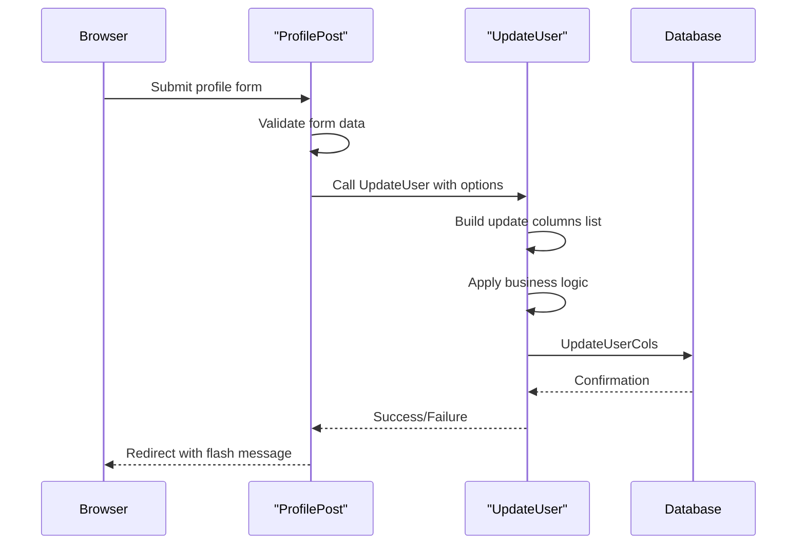
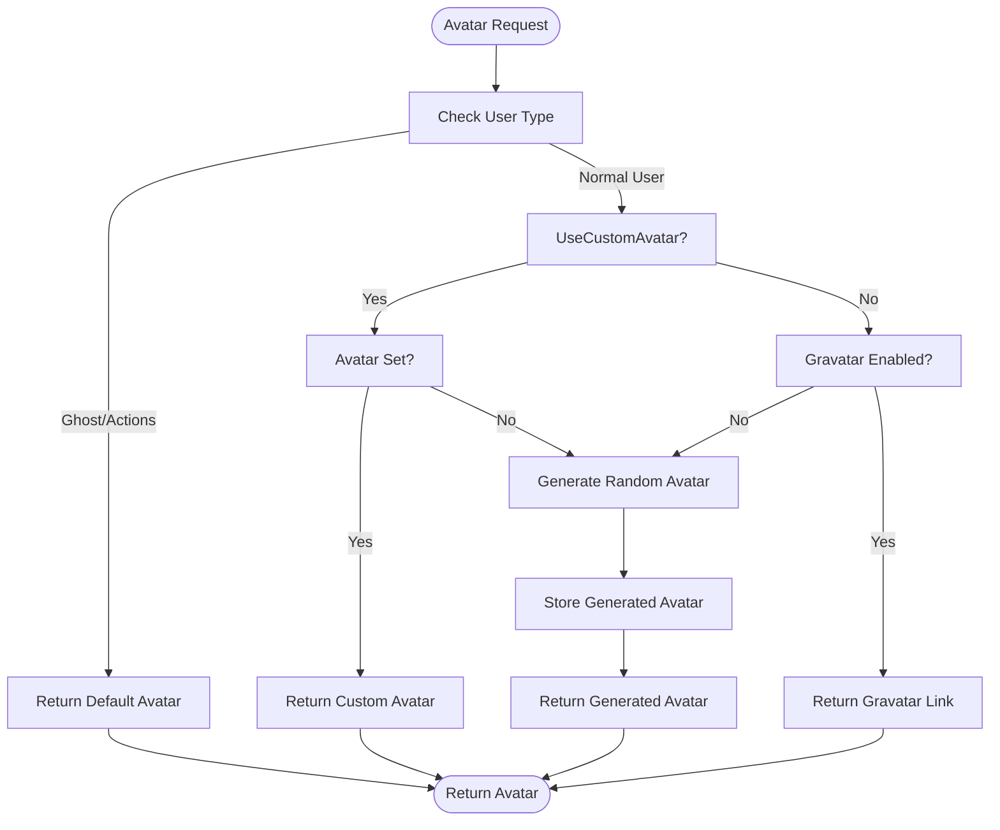

# User Profiles and Settings

<cite>
**Referenced Files in This Document**   
- [models/user/user.go](file://models/user/user.go)
- [services/user/update.go](file://services/user/update.go)
- [routers/web/user/setting/profile.go](file://routers/web/user/setting/profile.go)
- [models/user/avatar.go](file://models/user/avatar.go)
- [models/user/setting.go](file://models/user/setting.go)
</cite>

## Table of Contents
1. [User Data Storage](#user-data-storage)
2. [Profile Update Workflow](#profile-update-workflow)
3. [Settings Interface](#settings-interface)
4. [Avatar System](#avatar-system)
5. [Common Issues](#common-issues)
6. [Performance Considerations](#performance-considerations)

## User Data Storage

The user profile data in Gitea is primarily managed through the `User` struct defined in `models/user/user.go`. This struct contains comprehensive fields for storing user identity, contact information, preferences, and system metadata. Key fields include:

- **Username**: Stored in both `Name` (display) and `LowerName` (case-insensitive lookup) fields, with validation through `IsUsableUsername` to prevent conflicts with reserved names and patterns.
- **Email**: The primary email is stored in the `Email` field, with `KeepEmailPrivate` controlling visibility. The system validates email format using a comprehensive regex pattern and checks for uniqueness during registration.
- **Avatar**: Managed through `Avatar` (storage path), `AvatarEmail` (source for generated avatars), and `UseCustomAvatar` (flag for custom uploads) fields.
- **Preferences**: Includes `Theme`, `DiffViewStyle`, `Language`, `Location`, `Website`, and `Description` fields that allow users to customize their experience.

The `BeforeUpdate` hook ensures data consistency by automatically converting usernames and emails to lowercase, while the `AfterLoad` hook applies default values like the default theme when none is specified.

**Section sources**
- [models/user/user.go](file://models/user/user.go#L150-L200)

## Profile Update Workflow

The profile update process is orchestrated through the `UpdateUser` function in `services/user/update.go`, which follows a structured update pattern using optional fields. The workflow:

1. Accepts an `UpdateOptions` struct containing optional values for each modifiable field
2. Processes each field only if it has been explicitly set in the options
3. Builds a list of database columns to update based on changed fields
4. Applies validation and business logic (e.g., preventing removal of the last admin)
5. Persists changes through `UpdateUserCols`

The system uses Go generics with `UpdateOptionField[T]` to handle optional updates safely, ensuring that only explicitly provided values are modified. Special handling exists for critical operations like admin status changes, which validate that at least one admin account remains in the system.

The update process is triggered from the web interface in `routers/web/user/setting/profile.go` where form data is mapped to `UpdateOptions` and processed through the service layer.

**Diagram sources**
- [services/user/update.go](file://services/user/update.go#L50-L150)
- [routers/web/user/setting/profile.go](file://routers/web/user/setting/profile.go#L69-L85)

**Section sources**
- [services/user/update.go](file://services/user/update.go#L50-L150)
- [routers/web/user/setting/profile.go](file://routers/web/user/setting/profile.go#L69-L85)

## Settings Interface

The user settings interface is implemented across multiple routes in `routers/web/user/setting/profile.go`, providing a comprehensive configuration experience. The interface includes:

- **Profile Settings**: Managed through `ProfilePost`, allowing updates to username, full name, email visibility, location, website, and description
- **Appearance Settings**: Handled by `UpdateUIThemePost` and `UpdateUserLang`, enabling theme and language customization
- **Organization Management**: Provided through the `Organization` handler for managing organizational affiliations
- **Repository Management**: Available via the `Repos` handler for repository administration

The interface uses form validation and flash messages to provide user feedback, with specific error handling for common issues like username conflicts. The `UpdateAvatarSetting` function manages avatar uploads with size and type validation, ensuring only valid image files are accepted.

**Section sources**
- [routers/web/user/setting/profile.go](file://routers/web/user/setting/profile.go#L44-L431)

## Avatar System

The avatar system in Gitea, implemented in `models/user/avatar.go`, provides multiple avatar sources and generation methods:

1. **Custom Uploads**: Users can upload custom avatars, stored in the `Avatars` storage system with filenames based on a hash of the user ID and image data
2. **Generated Avatars**: When no custom avatar is set, the system generates random avatars using the user's email as a seed for consistent generation
3. **Gravatar Integration**: As a fallback, the system can use Gravatar based on the `AvatarEmail` field

The `AvatarLinkWithSize` method determines the appropriate avatar source based on user preferences and system configuration, with logic to handle edge cases like disabled Gravatar or offline mode. The system automatically generates random avatars when needed and stores them efficiently in the configured storage backend.

**Diagram sources**
- [models/user/avatar.go](file://models/user/avatar.go#L40-L100)

**Section sources**
- [models/user/avatar.go](file://models/user/avatar.go#L40-L100)

## Common Issues

Several common issues are addressed in the user profile system:

- **Email Validation**: The system validates email format using a comprehensive regex pattern and checks for uniqueness during registration and updates. The `ValidateEmail` function ensures proper email structure before acceptance.
- **Username Conflicts**: Username availability is checked through `IsUserExist`, which queries the database for existing users with the same name (case-insensitive). Reserved names and patterns are blocked by `IsUsableUsername`.
- **Profile Visibility**: The `Visibility` field controls profile discoverability, with validation in `UpdateUser` to ensure the selected visibility mode is allowed by system configuration.
- **Avatar Uploads**: Size limits are enforced through `setting.Avatar.MaxFileSize`, and file type validation ensures only supported image formats are accepted using the `typesniffer` package.

Error handling is comprehensive, with specific error types like `ErrUserAlreadyExist` and `ErrEmailAlreadyUsed` providing clear feedback to users through the web interface.

**Section sources**
- [models/user/user.go](file://models/user/user.go#L500-L600)
- [routers/web/user/setting/profile.go](file://routers/web/user/setting/profile.go#L75-L95)

## Performance Considerations

The user profile system incorporates several performance optimizations:

- **Caching**: User settings are cached using the `cache` module, with `GetSetting` retrieving values from cache and falling back to database lookup when necessary. The cache key follows the pattern `user_{id}.setting.{key}`.
- **Selective Updates**: The `UpdateUser` function only updates database columns that have actually changed, reducing unnecessary writes and maintaining optimal database performance.
- **Batch Operations**: The system uses XORM's batch operations for efficient database interactions, particularly in user settings retrieval through `GetSettings`.
- **Lazy Loading**: Related data like organizations and repositories are loaded on-demand rather than eagerly, reducing initial load times for the settings interface.

The avatar system also optimizes performance by serving avatars through the configured storage backend (potentially CDN-backed) and generating random avatars only when first requested, then caching them for subsequent requests.

**Section sources**
- [models/user/setting.go](file://models/user/setting.go#L50-L100)
- [services/user/update.go](file://services/user/update.go#L50-L150)