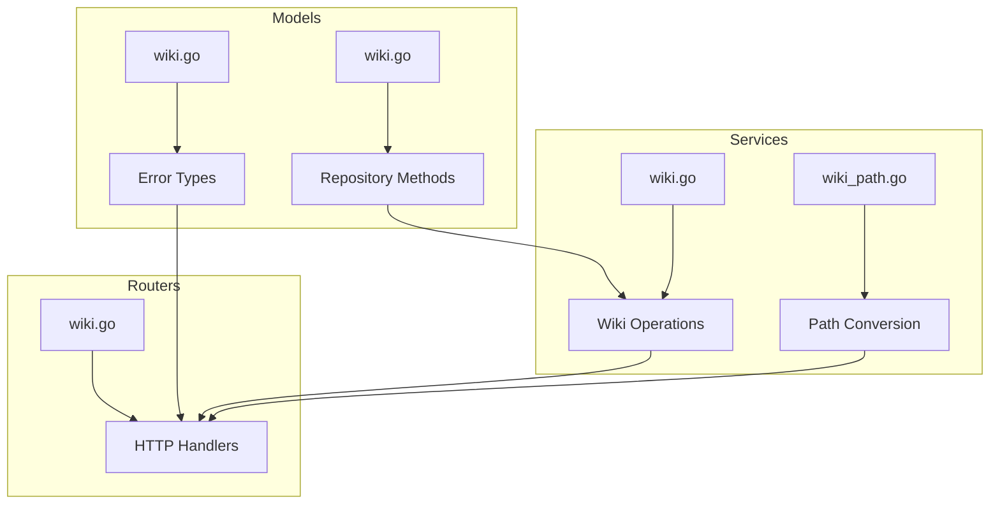
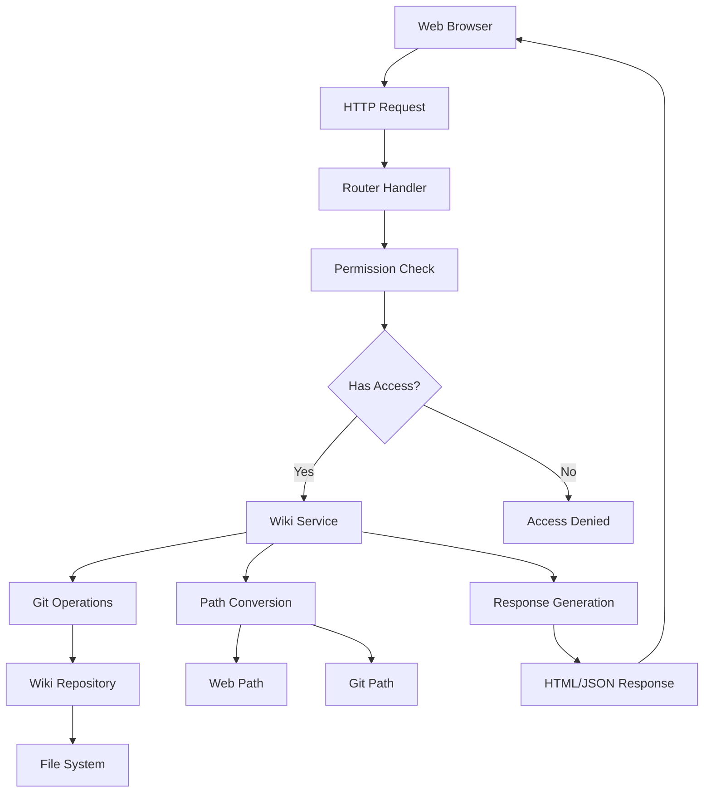
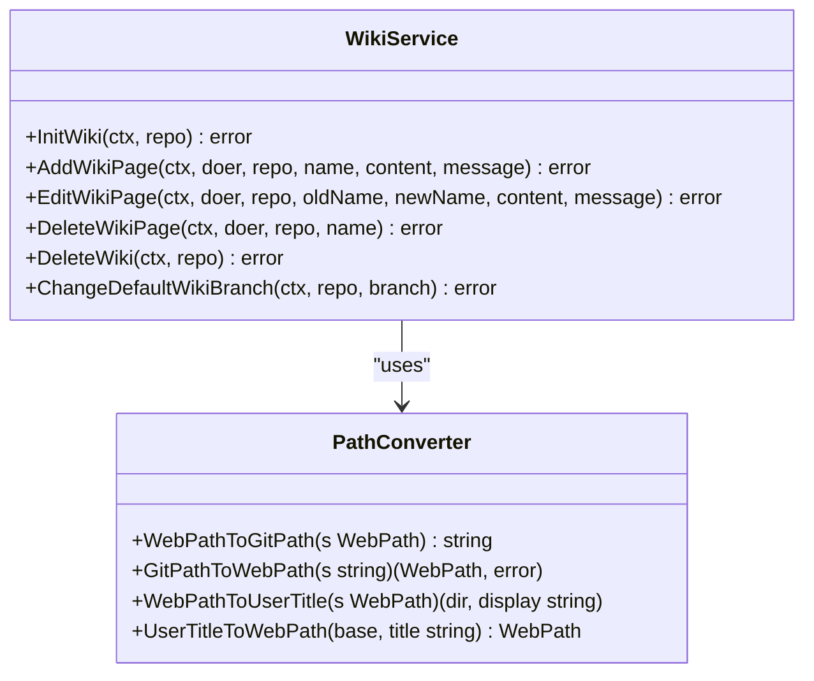
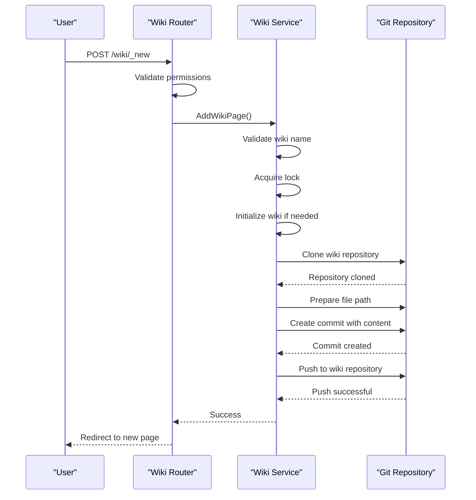
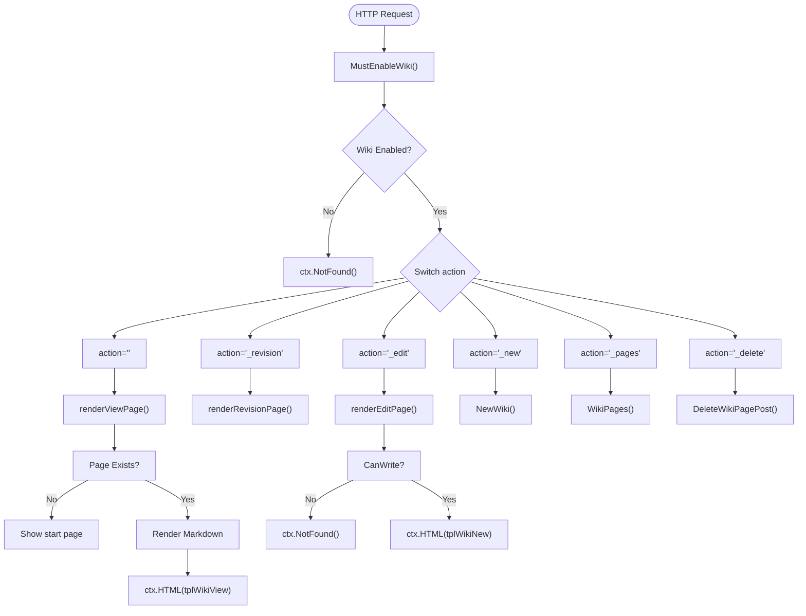
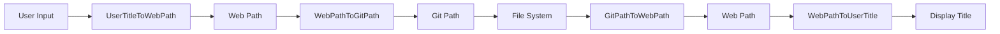
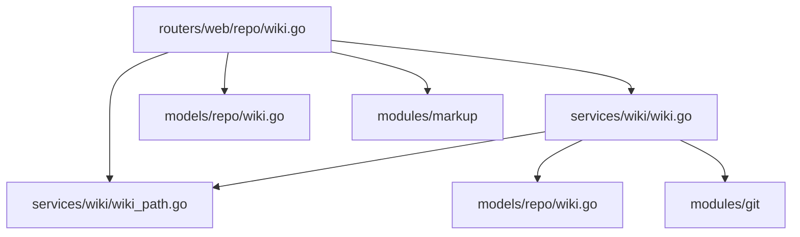

# Wiki

<cite>
**Referenced Files in This Document**   
- [wiki.go](file://services/wiki/wiki.go)
- [wiki_path.go](file://services/wiki/wiki_path.go)
- [wiki.go](file://routers/web/repo/wiki.go)
- [wiki.go](file://models/repo/wiki.go)
</cite>

## Table of Contents
1. [Introduction](#introduction)
2. [Project Structure](#project-structure)
3. [Core Components](#core-components)
4. [Architecture Overview](#architecture-overview)
5. [Detailed Component Analysis](#detailed-component-analysis)
6. [Dependency Analysis](#dependency-analysis)
7. [Performance Considerations](#performance-considerations)
8. [Troubleshooting Guide](#troubleshooting-guide)
9. [Conclusion](#conclusion)

## Introduction
Gitea's wiki system provides a collaborative knowledge sharing platform integrated within repositories. It enables teams to create, edit, and maintain documentation using Markdown formatting with full version control. The wiki functionality is tightly coupled with repository permissions, ensuring secure access while supporting features like page creation, editing, versioning, and access control. This document details the implementation of wiki services in `services/wiki` and routing in `routers/web/repo/wiki.go`, covering all aspects of wiki management within Gitea.

## Project Structure
The wiki system in Gitea is organized across multiple directories with clear separation of concerns. The core wiki logic resides in `services/wiki`, while web request handling is managed in `routers/web/repo/wiki.go`. Model-level definitions and error types are located in `models/repo/wiki.go`. This structure enables modular development and maintenance of wiki features.

**Diagram sources**
- [services/wiki/wiki.go](file://services/wiki/wiki.go)
- [services/wiki/wiki_path.go](file://services/wiki/wiki_path.go)
- [routers/web/repo/wiki.go](file://routers/web/repo/wiki.go)
- [models/repo/wiki.go](file://models/repo/wiki.go)

**Section sources**
- [services/wiki/wiki.go](file://services/wiki/wiki.go)
- [routers/web/repo/wiki.go](file://routers/web/repo/wiki.go)

## Core Components
The wiki system consists of several core components that work together to provide comprehensive documentation capabilities. These include wiki service operations for managing pages, path conversion utilities for handling URL and file path transformations, HTTP route handlers for web interactions, and model-level definitions for repository wiki operations and error handling.

**Section sources**
- [services/wiki/wiki.go](file://services/wiki/wiki.go#L1-L400)
- [services/wiki/wiki_path.go](file://services/wiki/wiki_path.go#L1-L172)
- [routers/web/repo/wiki.go](file://routers/web/repo/wiki.go#L1-L760)
- [models/repo/wiki.go](file://models/repo/wiki.go#L1-L86)

## Architecture Overview
Gitea's wiki architecture follows a layered approach with clear separation between service logic, routing, and data models. Wiki pages are stored in a separate Git repository (`.wiki.git`) associated with each repository, enabling full version control and branching capabilities. The system uses a middleware-based permission model to enforce access control based on repository permissions.

**Diagram sources**
- [routers/web/repo/wiki.go](file://routers/web/repo/wiki.go#L1-L760)
- [services/wiki/wiki.go](file://services/wiki/wiki.go#L1-L400)

## Detailed Component Analysis

### Wiki Service Implementation
The wiki service in `services/wiki/wiki.go` provides the core functionality for managing wiki pages. It handles operations such as page creation, editing, deletion, and initialization of wiki repositories. All operations are performed through Git commands, ensuring version control and audit trails.

#### Wiki Operations

**Diagram sources**
- [services/wiki/wiki.go](file://services/wiki/wiki.go#L1-L400)
- [services/wiki/wiki_path.go](file://services/wiki/wiki_path.go#L1-L172)

#### Wiki Page Creation Flow

**Diagram sources**
- [routers/web/repo/wiki.go](file://routers/web/repo/wiki.go#L500-L600)
- [services/wiki/wiki.go](file://services/wiki/wiki.go#L150-L200)

### Web Routing Implementation
The web routing component in `routers/web/repo/wiki.go` handles all HTTP requests related to wiki functionality. It provides endpoints for viewing, creating, editing, and deleting wiki pages, as well as listing available pages and viewing revision history.

#### Wiki Request Handling

**Diagram sources**
- [routers/web/repo/wiki.go](file://routers/web/repo/wiki.go#L1-L760)

**Section sources**
- [routers/web/repo/wiki.go](file://routers/web/repo/wiki.go#L1-L760)

### Path Conversion System
The path conversion system in `services/wiki/wiki_path.go` handles the transformation between web paths (URLs) and Git paths (file system). This ensures proper handling of special characters, spaces, and reserved names while maintaining compatibility with existing wiki content.

#### Path Conversion Logic

**Diagram sources**
- [services/wiki/wiki_path.go](file://services/wiki/wiki_path.go#L1-L172)

**Section sources**
- [services/wiki/wiki_path.go](file://services/wiki/wiki_path.go#L1-L172)

## Dependency Analysis
The wiki system has well-defined dependencies between components, with clear separation of concerns. The routing layer depends on the service layer for business logic, while the service layer depends on path conversion utilities and Git operations.

**Diagram sources**
- [routers/web/repo/wiki.go](file://routers/web/repo/wiki.go)
- [services/wiki/wiki.go](file://services/wiki/wiki.go)
- [services/wiki/wiki_path.go](file://services/wiki/wiki_path.go)
- [models/repo/wiki.go](file://models/repo/wiki.go)

**Section sources**
- [routers/web/repo/wiki.go](file://routers/web/repo/wiki.go)
- [services/wiki/wiki.go](file://services/wiki/wiki.go)
- [services/wiki/wiki_path.go](file://services/wiki/wiki_path.go)
- [models/repo/wiki.go](file://models/repo/wiki.go)

## Performance Considerations
For large wikis with extensive content, performance considerations include efficient Git operations, caching of frequently accessed pages, and pagination of revision history. The system should handle large numbers of wiki pages without significant degradation in response time. Repository-level caching and optimized Git operations can help maintain performance as wiki content grows.

## Troubleshooting Guide
Common issues with the wiki system include formatting problems due to improper Markdown syntax and permission errors when users lack write access. Users may encounter "page already exists" errors when attempting to create duplicate pages or "reserved name" errors when using protected page names like _Sidebar or _Footer. Permission issues typically arise when users don't have write access to the repository's wiki unit.

**Section sources**
- [models/repo/wiki.go](file://models/repo/wiki.go#L1-L86)
- [routers/web/repo/wiki.go](file://routers/web/repo/wiki.go#L1-L760)

## Conclusion
Gitea's wiki system provides a robust platform for collaborative documentation with full version control and access management. By leveraging Git for storage and versioning, it ensures that all changes are tracked and can be reverted if needed. The system's modular architecture separates concerns between routing, service logic, and path conversion, making it maintainable and extensible. With support for Markdown formatting and integration with repository permissions, it offers a comprehensive solution for project documentation needs.